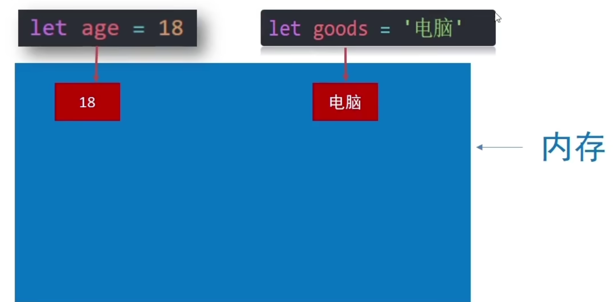
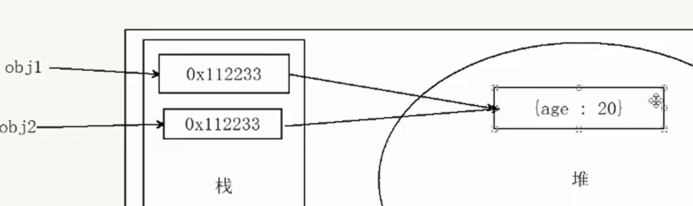
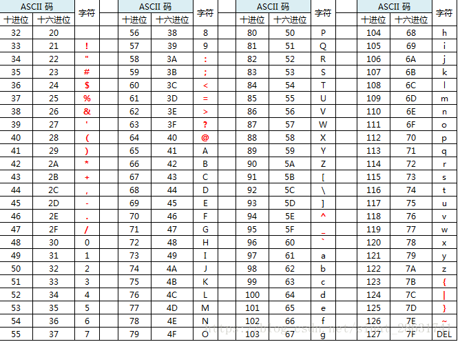
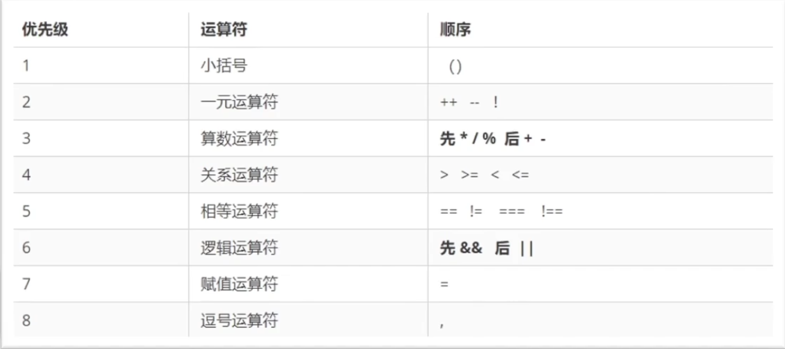
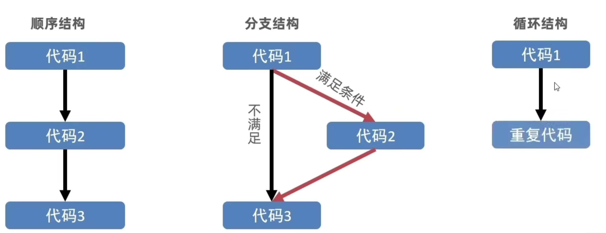
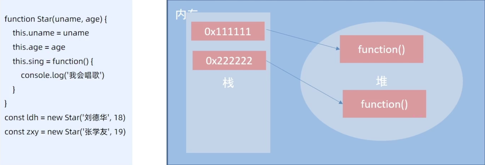
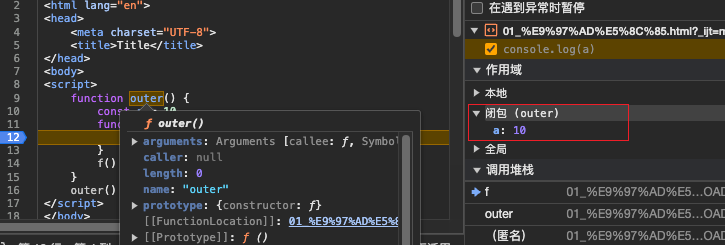
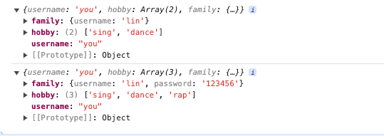
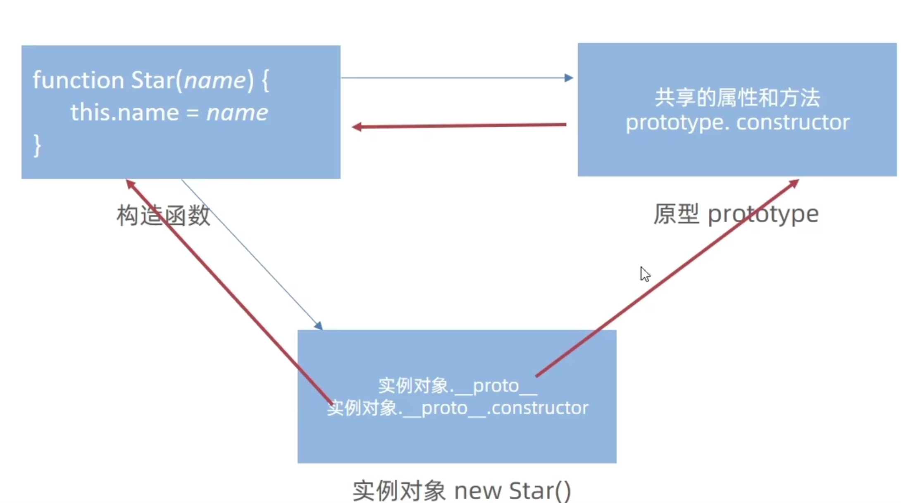
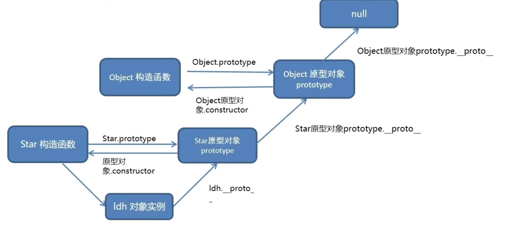

# JavaScript基础

## JS简介

### JavaScript是什么

是一种运行在客户端（浏览器）的编程语言，实现人机交互的效果。面向函数编程

#### 作用

- 网页特效（监听用户的一些行为让页面作出对应的反馈）
- 表单验证（针对表单数据的合法性进行判断）
- 数据交互（获取后台的数据，渲染到前端的浏览器）
- 服务端编程（node.js）

#### 组成

- ECMAScript: JavaScript基础语言，规定了js基础语法核心知识。
- Web APIs
  - DOM: 操作文档，比如对页面元素进行移动、大小、添加删除等操作
  - BOM: 操作浏览器，比如页面弹窗，检测窗口宽度、存储数据到浏览器等等

### JavaScript怎么写

#### 代码书写位置

- HTML内部: 写在`<body>`最下方。让其他HTML元素加载完毕后再加载JS。

- 外部JavaScript: 通过`src`属性引入外部js文件，标签中间不要写内容。
- 内联JavaScript: 代码写在标签内部。像*VUE*等框架会使用到。

#### 结束符

- 使用英文的`;` 代表语句结束。
- 结束符可以省略，要么都写要么都不写。

### 输入和输出语法（规则）

什么是语法？？？规则。

如何计算机打交道的规则约定。我们要按照这个规则去写，我们需要操作计算机，需要计算机能看懂。

#### 输出语法

1. 文档输出内容

   作用：向body内输出内容

   注意：如果输出的内容写的是标签，也会被解析成页面元素。

   ```javascript
   document.write('我是div标签');
   document.write('<h1>可以输出一个一级标题</h1>');
   ```

2. alert

   作用：页面弹出警告对话框。

   ```javascript
   alert('努力，奋斗。');
   ```

3. 控制台输出语法

   作用：程序员调试使用。

   ```javascript
   console.log('debug...');
   ```

#### 输入语法

1. prompt

   作用：显示一个对话框，对话框中包含一条提示信息，提示用户输入信息。

   ```javascript
   prompt('请输入内容');
   ```

#### 代码执行顺序

- 按HTML文档流顺序执行JavaScript代码
- alert()和prompt()他们会跳过页面渲染先被执行。

### 字面量

在计算机中，字面量是在计算机中描述 事/物。

比如：

- 我们的工资是： 1000。此时1000就是 数字字面量。
- ‘程序员‘字符串字面量。
- [] 数组字面量、{} 对象字面量等等。

## 变量

### 变量是什么

变量是计算机<mark>存储数据</mark>的`容器`,他可以让计算机变得有记忆. 变量不是数据本身,他们仅仅是一个用于存储数值的容器. 可以理解为是一个个用来`装东西`的纸箱子.

### 变量的基本使用

#### 变量的声明

语法: 声明关键字 变量名(标识)

```javascript
let 变量名;
```

#### 变量赋值

定义了一个变量之后, 你就能够`初始化`它. 其中的`=`成为*赋值运算符*

```javascript
let 变量名;
变量名 = 变量值;  

let age;
// 变量值就是字面量
age = 18;
```

声明的同时也可以直接赋值.

```javascript
let 变量名 = 变量值;
// 变量的初始化
let age = 18;
```

#### 更新变量

变量赋值后,还可以通过简单地给他一个不同的值来更新变量.

```javascript
let age = 18;
// 更新变量
age = 19;
```

#### 声明多个变量

语法: `let 变量名 = 变量值, 变量名 = 变量值;`可以连续声明多个变量.(不推荐)

为了代码的可读性, 一行只声明一个变量.

```javascript
let age = 18, name = 'hugh';
```


### 变量的本质

> 内存: 计算机中存储数据的地方, 相当于一个`空间`.
>
> 变量本质: 程序在内存中申请的一块用来存放数据的`小空间`. 
>
> 声明变量相当于得到了内存空间.  变量名是这部分`小空间`的`名称`.




### 变量命名规则和规范

规则: 必须遵守,不遵守报错

规范: 建议, 不遵守不会报错, 但不符合业内通识.


1. 规则
   - 不能使用关键字(有特殊含义的字符,JS内置的一些英语词汇. e.g. let、var、if、for等).
   - 只能使用下划线、字幕、数字、$组成,且数字不能开头.
   - 字母严格`区分大小写`, 如AGE和age是两个不同的变量.
2. 规范
   - 起名要有意义
   - 遵守小驼峰命名法(第一个单词首字母小写,后面每个单词首字母大写) e.g. userName


### 变量拓展-数组

> 数组的声明语法: let 数组名 = [数据1, 数据2, ..., 数据n]

```javascript
let names = ['Tom', 'James', 'Curry'];
```

> 数组的取值语法: 数组名[下标]

```javascript
names[0] // Tom
names[1] // James
names[2] // Curry
```

> 获取数组的长度: 数组名.length

```javascript
console.log(names.length) // 3
```

- 数组可以使<mark>单个变量存储多个数据</mark>
- 数组是按顺序保存数据, 所以每个数据都有自己的索引(编号)
- 数组可以存储任意类型的数据
- 数组的长度等于`最后一个索引号` + 1


### 变量提升

把所有`var`声明的变量提升到当前作用域的最前面, `只提升声明, 不提升赋值`

```javascript
console.log(num) // undefined
var num = 10
```

上述代码实际会被转换为

```javascript
var num
console.log(num)
num = 10
```


## 常量

### 常量的基本使用

使用const声明的*变量*称为“常量”. 

- 常量不允许更改值
- **常量声明的时候必须初始化**

```javascript
// 声明一个常量
const PI = 3.14;
```


##  数据类型

为什么要给数据分类???

1. 更加充分和高效的利用内存
2. 更加方便我们使用数据


JavaScript中的数据类型可以分成两个大类: *基本数据类型(值类型)*、*引用数据类型(引用类型)*.

基本数据类型包括: number、string、boolean、undefined、null

引用数据类型包括: object、symbol(除了5种基本类型外的其他类型都是引用数据类型)


- `值类型`: 又叫简单数据类型/基本数据类型, 在存储时变量中存储的是值本身, 因此叫做值类型

- `引用类型`: 复杂数据类型, 存储时变量中存储的仅仅是`地址(引用)`, 因此叫做引用数据类型





### 数字类型(Number)

JS是*弱数据类型*的语言, 只有当我们赋值了, 才知道是什么数据类型.

Java是*强数据类型*, 声明时就确定了变量的数据类型.

数字可以有很多操作, 经常和*算数运算符*(+、-、*、/、%)一起使用.


> 区域运算符(**%**)可以用来判断某个数字能否被整除


### 字符串类型(string)

通过单引号、双引号、烦引号包裹的数据都叫字符串. 推荐使用**单引号**.

```javascript
let username = 'hugh'
let gender = "male"
let email = `121@gmail.com`
let str = '' // 空字符串(空串)
```

注意点: 

- 无论单引号还是双引号必须成堆使用
- 单引号/双引号可以互相嵌套, 但是不可以自己嵌套自己
- 可以使用转义符**/**, 输出单引号或双引号

> 字符串拼接
>
> 方式一: **+**可以使**两个字符串**拼接或者**字符串与数字**拼接
>
> 方式二: 使用`模版字符串`(推荐使用)

```javascript
let age = 18
// 方式一
document.write('我今年' + age + '了')
// 方式二
document.write(`我今年${age}岁了`)
```

### 布尔类型(boolean)

表示肯定或者否定时在计算机中对应的是布尔类型数据, 它有两个固定的值`true`、`false`


> <mark>''、0、undefined、null、false、NaN转为Boolean后都是false, 其余则为true</mark>

### 未定义类型(undefined)

未定义类型是比较特殊的类型,只有一个值undefined. 


只声明变量, 不赋值的情况下, 变量的默认值为undefined, 一般很少直接为某个变量赋*字面量*undefined.

```javascript
let age
console.log(age)  // undefined
```

> 使用场景: 声明一个变量, 等待传送过来的数据. 如果我们不知道这个数据是否传递过来, 此时我们就可以通过检测这个变量是不是undefined, 判断是否有数据传递过来.


### 空类型(null)

JS中null仅仅是一个代表“无”、“空”或“值未知“的特殊值

```javascript
let obj = null
console.log(obj) // null
```

`null`和`undefined`的区别:

- undefined表示没有赋值
- null表示赋值了, 但是内容是空(通常用于对象)
- <mark>undefined + 1 输出的值为NaN, null + 1 输出的值为 1</mark>

> `null` 的使用场景: 把null作为尚未创建的对象(*将来*有个变量里面存放的是一个对象, 但是目前还没有这个对象, 可以先给个null)


### 检测数据类型(typeof)

`typeof`支持两种语法

- typeof x: 作为**运算符**(推荐)
- typeof(x): 作为函数


## 数据类型的转换

### 为什么需要类型转换

JavaScript是*弱类型语言*: JS也不知道变量到底属于哪种数据类型, 只有赋值了才清楚.

因此使用表单、prompt获取的数据**默认都是字符串类型**的, 因此, 如果想让变量参与运算时就需要类型转换.

```javascript
let age = prompt('请输入您的年龄:')
console.log(typeof age)  // string
```

> 类型转换: 把一种数据类型的变量转换成我们需要的数据类型


### 隐式转换(自动)

> 某些运算符被执行时, 系统内部自动将数据类型进行转换, 成为<mark>隐式转换</mark>

- *+*号两边只要有一个是字符串, 都会把另一个转成字符串后拼接(必须两边都有值)
- *+*如果单用的话, 会把值转为数字型
- <mark>除了+以外的算术运算符,都会把数据类型转成数字</mark>

```javascript
console.log(2 + '2') // 2+2
console.log(2 - '2') // 0

console.log(+'123') // 123 转换成数字型
console.log(typeof +'123') // number
console.log(+'11' + 11) // 22
```

>- 有字符串的加法 "" + 1, 结果是"1"
>- 减法 - (项大多数数学运算符一样)只能用于数字, 它会使空字符串""转换为0
>- null经过数字转换之后会变成0
>- undefined经过数字转换之后会变成NaN
>- **null == undefined 但 null !== undefined**

### 显式转换(手动)

自己写代码告诉系统应该转成什么类型

#### 转换为数字型

方式一: Number(数据)

- 转成数字类型
- 如果字符串内容里有非数字, 转换失败时结果为NaN
- **NaN也是number类型的数据, 代表非数字**

方式二: parseInt(数据)

- 只保留整数(**可以直接获取到整数部分**)
- 数据必须以数字开头

```javascript
console.log(parseInt('12px'))  // 12
console.log(parseInt('abc12px'))  // NaN 此时会无法获取
```

方式三: parseFloat(数据)

- 可以保留小数
- 数据必须以数字开头

```javascript
console.log(parseFloat('12.34px')) // 12.34
console.log(parseFloat('abc12.34px')) // NaN
```

方式四: +/-数据

- 可以保留小数
- 不能出现非数字, 否则会变成NaN

```javascript
let num = +'1'
console.log(num + '1') //2 
console.log(num) // number
```


## 运算符

根据所需要表达式的个数,可以分为 `一元运算符`、`二元运算符`、`三元运算符`

例如: 正负号是一元运算符, 加号是二元运算符.

### 赋值运算符

对变量进行赋值的运算符, 赋值运算符的左边必须是一个**变量**(变量)

赋值运算符包括 `=`、 `+=`、`-=`、`*=`、`/=`.


```javascript
let num = 1
num + 1  // num: 1
num = num + 1 // num: 2
num += 1
```

### 自增、自减运算符

自增:

- 符号: `++`
- 作用: 让变量的值 +1

自减:

- 符号: `--`
- 作用: 让变量的值 -1


> 自增自减运算符`前置和后置`单独使用时没有区别, 如果**参与运算**了, 那他们就有区别了.

```javascript
// 当 i = 1
console.log(++i + 1) // 3
console.log(i++ + 1) // 2
console.log(i++ + ++i + i) // 1 + 3 + 3 = 7
```

### 比较运算符

比较运算符又叫关系运算符, 通常用于比较两个数据大小、是否相等等. 比较结果为`boolean`, 即只会得倒**true**或者**false**

> 不同个数`=`的对比

| 运算符 |                        作用                        |
| :----: | :------------------------------------------------: |
|   =    |       赋值运算, 把符号右边的值放进左边的容器       |
|   ==   | 判断符号两边是否相等(只判断值, 具有`隐式类型转换`) |
|  ===   |         判断符号两边是否全等(数据类型和值)         |

例1: `比较运算符具有隐式转换` 会把字符串’2‘ 转换成 2

```javascript
console.log('2' == 2) // true
```

例2: `===`或`!==`会判断值和数据类型

```javascript
console.log('2' === 2) // false
```

例3: NaN不等于任何人, 包括他自己

```javascript
console.log(NaN === NaN) // false
```

例4: undefined与null进行比较

```javascript
console.log(undefined == null) // true(会隐式转换为数字进行比较)
console.log(undefined === null) // false
```

两个字符串比较时, 比较的是字符串的 *ASCII码*

- 从左往右依次比较, 如果第一位一样再比较第二位, 以此类推



```javascript
console.log('a' < 'b') // true
console.log('aa' < 'ab') // true
console.log('aa' < 'aac') // true
```


> ⚠️ NaN不等于任何值, 包括它本身
>
> ⚠️ 尽量不要比较小数, JS的小数有精度问题, 应该把小数转换为整数再进行比较
>
> ⚠️ 不同类型之间比较会发生隐式转换. 因此,  开发中判断是否相等, 强烈推荐使用 `===`


### 逻辑运算符

逻辑运算符用来解决多重条件判断. e.g. num > 5 && num < 10

| 符号 |   名称   |                      特点                       |
| :--: | :------: | :---------------------------------------------: |
|  &&  | 逻辑与() | 符号两边的运算结果必须同时为 `true`, 则返回true |
| \|\| |  逻辑或  |     符号两边只需要一个为 `true`, 则返回true     |
|  !   |  逻辑非  |        取反, 一元运算符, 真变假, 假变真         |

> ⚠️ 逻辑运算符具有`短路作用`(当满足一定条件时会让右边代码不执行)
>
> - || : 左边为true就中断
> - &&: 左边为false就中断


```javascript
console.log(11 && 22) // 都是真, 返回最后一个真值 22
console.log(11 || 22) // 输出第一个真值

// 给函数赋默认参数值
function fn(x, y) {
  x = x || 0
  y = y || 0
}
```


### 运算符优先级




```javascript
let a = 3 > 5 && 2 < 7 && 3 == 4
console.log(a) // false 
let b = 3 <= 4 || 3 > 1 || 3 != 2
console.log(b) // true
let c = 2 === '2'
console.log(c) // false
let d = !c || b && a
console.log(d) // true
```


> ⚠️ 一元运算符里面的逻辑非运算优先级非常高
>
> ⚠️ `逻辑与比逻辑或优先级高`


## 语句

### <span id='expression'>表达式</span>和语句

什么是表达式? 表达式是可以被求值的代码, JS引擎会将其计算出一个结果, 3 + 4, num++等都是表达式

什么是语句? 语句是一段可以执行的代码, 比如if语句、for循环语句等等

<table style="text-align: center; border='1px solid #000'">
	<tr>
		<th  colspan="2">表达式和语句的区别</th>
	</tr>
	<tr>
		<td>表达式</td>
		<td>表达式可以被求值, 所以它可以卸载赋值语句的右侧</td>
	</tr>
	<tr>
		<td>语句</td>
		<td>语句不一定有值, 比如alert()、for等语句就不能被用于赋值</td>
	</tr>
</table>


### 分支语句

程序的三种流程控制语句

1. 顺序结构: 从上往下依次执行, 每条语句都会执行到
2. 分支结构: 根据条件选择执行代码(`有选择性`)
3. 循环语句: 某段代码被`重复`执行




分支语句包含: `if分支`、`三元运算符`、 `switch分支`


#### if分支语句

if分支语句又分为单分支语句、双分支语句、多分枝语句

```javascript
// 单分支语句
if(条件) {
  符合条件时执行这里的语句
}
```

```javascript
// 双分支语句
if(条件) {
  满足条件要执行的代码
} else {
  不满足条件执行的代码
}
```

```javascript
// 多分支if语句
if(condition1) {
  code1
} else if(condition2) {
  code2
} else if(condition3) {
  code3
} else {
  codeelse
}
```


上面的代码块中的**条件表达式**值如果不为`boolean`类型, 就会发生**隐式类型转换**, 因此具有如下特点:

- 当条件为数字时, 除了0和NaN所有的数字都为真
- 当条件为字符串时, 除了**''**(空字符串)都为真
-  ⚠️ ' '和''不一样, ' '为真, ''为假


例1: 判断指定年份是闰年还是平年?

```javascript
let year = +prompt('请输入年份:')
if (year % 4 === 0 && year % 100 !== 0 || year % 400 === 0) {
	alert(`${year}是闰年`);
} else {
	alert(`${year}是平年`)
}
```

#### 三元运算符

三元运算符(需要三个操作数)通用 `?`与 `:`配合使用, 一般用来取值

语法如下, 当condition为true时, 执行code1, 否则执行code2

```javascript
condition ? code1 : code2
```

例1: 输入一个数字, 如果数字小于10, 就在前面补一个0

```javascript
let num = prompt('请输入一个数字:')
alert(num < 10 ? 0 + num : num) // +两边有一个字符串, 则结果为字符串
```

#### switch语句

找到跟目标数据相等的case, 并执行里面对应的代码; 如果没有`全等`, 则执行`default`里面的代码

```javascript
switch (data) {
  case value1: {
    code1
    break
  }
  case value2: {
    code2
    break
  }
  case value3 {
    code3
    break
	}
	default { // 相当于if...else...分支中的else部分
		codeDefault 
	}
}
```

> ⚠️ 必须确保case中有`break`, 否则会发生穿透(之后的case都会执行, 直到遇见break或者执行完default)

> <span id='penetrate'>什么是穿透?</span>
>
> 执行完指定case的代码块后, 不会退出该switch代码块, 而是继续执行下一个case的代码块, 直到遇见break或者执行完default代码块

例1: 实现一个简易计算器

```javascript
let num1 = +prompt('please input the first number:')
let num2 = +prompt('please input the second number:')
let operator = prompt('please input the operator:')
let result
switch (operator) {
	case '+':
		result = num1 + num2
		break
	case '-':
		result = num1 - num2
		break
	case '*':
		result = num1 * num2
		break
	case '/':
		result = num1 / num2
		break
	default:
		alert('Not an operator')
}
alert(`result is ${result}`)
```

switch和if之间的区别:

- switch…case语句通常处理case为**确定值**的情况, 而if…else…语句更加灵活, 通常用于范围判断
- switch语句进行判断后直接执行到程序的语句, 效率更高. 而if…else…语句有几种判断条件, 就得判断多少次
- switch一定要注意必须是 `===`全等, 一定注意数据类型, 同时一定要写`break`, 否则会有<a href="#penetrate">穿透效果</a>


### 循环语句

`循环`: 重复执行一些操作

循环的本质就是以某个变量为`起始值`, 然后不断`产生变化量`, 慢慢`靠近终止条件`的过程

#### while循环

while: 在…期间, 满足条件期间, 重复执行某段代码

```javascript
while(条件) {
  code // 循环体
}
```

while大括号里面代码执行完毕后不会跳出, 而是继续回到小括号里面判断条件是否满足, 若满足又执行大括号里的代码, 然后再回到小括号判断条件, 直到括号里的条件不满足才跳出


while循环的三要素:

- 变量起始值
- 终止条件(没有终止条件, 循环会一直执行, 造成死循环)
- `变量变化量(改变条件涉及的变量, 用自增或者自减)`


#### for循环

for循环把循环三要素(声明起始值、终止条件、变量变化量)写在一起,一目了然, 最为常用


for循环的语法:

```javascript
for (变量起始值; 终止条件; 变量变化量) {
  // 循环体
}
```

for循环的最大价值: `循环数组`

```javascript
let array = ['jack', 'zhao', 'zhang', 'huang']
for (let i = 0; i < array.length; i++) {
  console.log(array[i]);
}

console.log(array[6666]) // undefined JS不存在数组越界问题
```

无限循环的写法: 

- while(true)
- for( ; ;)

> 什么时候用for循环, 什么时候使用while
>
> - 如果明确了循环的次数的时候使用for
> - 存在循环嵌套时, 使用for
> - 当不明确循环的次数时, 使用while


##### for循环嵌套

一个循环里面有另一个循环

```javascript
for (外部声明纪录循环次数的变量; 循环条件; 变化值) {
  for (内部声明纪录循环次数的变量; 循环条件; 变化值) {
    循环体
  }
}
```


### 循环退出

- break: 退出整个循环, 用于结果已经得到, 后续的循环`不需要`再执行
- continue: 结束本次循环, 继续下次循环(不退出整个循环), 用于`排除或者跳过`某一个选项

例: 页面弹出对话框, ‘你爱我吗’, 如果输入’❤️’, 则退出循环, 否则一直弹出

```javascript
let answer
while (answer !== '❤️') {
	answer = prompt('你爱我吗')
}
alert('❤️')
```


## 数组

### 数组的基本使用

> 数组是一种可以按照顺序保存数据的`数据类型`, 是一种对象类型, 可以保存多个数据, 然后放到一个变量中, 方便管理和使用


1. 数组的声明语法

```javascript
// 通过数组字面量声明
let arr = ['James', 'Curry', 'Durant', true, 1] 
```

```javascript
// 通过new Array构造函数声明
let arr = new Array(1, 2, false, 'true')
```

数组里面可以存放任意类型的数据


2. 取值语法

`数组名[下标]`

```javascript
arr[0]; 
```

3. **遍历数组**

通过循环遍历数组

```javascript
let arr = ['James', 'Curry', 'Durant', true, 1] 
for(let i = 0; i < arr.length; i++) {
  console.log(arr[i])
}
```

4. 数组操作

- 更新数组中指定下标的元素

  `数组名[下标] = 值`

```javascript
let arr = []
console.log(arr) // []
console.log(arr[0]) // undefined
arr[0] = 'hello'
console.log(arr[0]) // hello

```

- 数组中新增元素

`数组.push()`: 将**一个或多个**元素添加到数组的<mark>末尾</mark>, 并返回数组的新长度

`数组.unshift()`: 将**一个或多个**元素添加到数组的<mark>开头</mark>, 并返回数组的新长度

```javascript
let arr = []
arr.push('hello', 'world')
arr.unshift('first', 'second')
```

- 删除数组中的数据

`数组.pop()`: 删除数组中的**最后一个**元素, 并返回该元素的值

`数组.shift()`: 删除数组中的**第一个**元素, 并返回该元素的值

`数组.splice(start, deleteCount)`: 删除指定元素, deleteCount为个数, 不写默认删到最后, 没有返回值

```javascript
let arr = [2, 10, 3, 45, 56, 212, 1, 33]
	let pop = arr.pop() // 删除最后一个元素, pop = 33
	let shift = arr.shift()
	arr.splice(2, 2)
```


5. 扩展运算符

语法: `…` , 一般用于求数组最大最小值、合并数组等场景

注意和<a href='restArg'>剩余参数</a>的区别

- 求数组最大最小值

```javascript
const arr = [1, 2, 3]
console.log(Math.max(...arr))  // 3
```

- 合并数组

```javascript
const arr = [1, 2, 3]
const arr1 = [4, 5, 6]
const arr2 = [...arr, ...arr1]
console.log(arr2)
```

### 数组结构

数组解构是将数组的单元值快速批量赋值给一系列变量的语法

1. 基本语法:

- 赋值运算符 = 左侧的[]用于批量声明变量, 右侧数组的元素将被赋值给对应位置的左侧的变量
- 变量的顺序对应数组单元值的位置依次进行赋值操作

```javascript
const [x, y, z] = [1, 2, 3]
// x = 1
// y = 2
// z = 3
```

2. 当右侧数组单元值多时, 可以使用剩余参数接收

```javascript
// 剩余参数 变量少, 单元值多的情况
const [a, b, ...c] = [1, 2, 3, 4]
console.log(c) // [3, 4]
```

3. 防止有undefined传递单元值的情况, 可以设置默认值

```javascript
const [a = 0, b = 0] = [1]
console.log(a, b) // a = 1, b =0
```

4. 按需倒入, 忽略某些返回值

```javascript
const [a, b, ,d] = [1, 2, 3, 4] // 直接跳过了第三个参数
```

5. 支持多维数组的解构

```javascript
const [a, b, [c, d]] = [1, 2, [3, 4]]
```


典型应用:交换两个变量

```javascript
let x = 1, y = 2; // 这里必须加分号
[y, x] = [x, y]
console.log(x, y)
```

> 当语句以数组开头时, 前一个语句必须加分号(立即执行函数也必须添加分号)


## 函数

> 什么是函数???
>
> `function`, 用于**执行特定任务**的代码块
>
> 函数可以把具有相同或相似逻辑的代码“包裹”起来, 通过**函数调用**执行这些被“包裹”的代码逻辑, 有利于精简代码方便复用, 比如alert()、prompt()、console.log() 都是一些js函数, 已经被封装好了, 可以直接使用


### 函数基础

1. 函数的声明语法

```javascript
function 函数名() {
	函数体
}
```

例子: 

```javascript
function hello() {
  console.log('hello world!')
}
```

2. 函数名命名规范

   - 和变量名称基本一致
   - 前缀应该为动词
   - 使用小驼峰命名

   

3. 函数的调用语法

**函数声明时不会执行**, 只有被调用时, 才会执行

```javascript
函数名()
```

4. 函数参数

```javascript
function 函数名(形参列表) {
  函数体
}
```

形参列表使用`,`分隔, 传参时实参应尽量保持个数与形参个数一致(JS允许不一致), 如果没有实参, 会使用默认值

```javascript
函数名(实参列表)
```

**形参**: 声明函数时写在函数名右边小括号里的叫形参(形式上的参数)

**实参**: 调用函数时写在函数名右边小括号里的叫实参(实际上的参数)

形参可以理解为是在这个<mark>函数代码块内</mark>声明的`变量`, 实参可以理解为是给这个变量**赋值**


5. 函数参数默认值

为了解决函数调用时, 没有传递实参, 在函数声明时可以指定形参的默认值(如果没有指定, 则为`undefined`)

```javascript
function 函数名(形参1 = 值1, 形参2 = 值2) {
  函数体
}
```

声明时的默认值只会在缺少实参参数传递时才会被执行, 所有有参数会优先执行传递过来的实参, 否则默认为undefined


6. 动态参数

`arguments`是函数内部内置的伪数组变量, 包含了调用函数时传入的所有实参

- arguments是一个伪数组, 只存在于函数中
- arguments的作用是动态获取函数的实参
- `箭头函数没有arguments`

```javascript
function func() {
  console.log(arguments)
}
```


7. <span id='restArg'>剩余参数</span>

剩余参数允许我们将一个不定数量的参数表示为一个数组

```javascript
function func(arg1, ...arr) {
  // 代码块
}
```

- …是语法符号, 置于最末函数形参之前, 用于获取多余的实参
- …获取的剩余实惨, 是个`真数组`


8. 函数返回值

函数是被设计为**执行特定任务**的代码块, 函数返回值用于把处理结果返回给调用者

不是所有函数都有返回值, 比如alert(). 但在大多数情况下都需要返回值

```javascript
function fn() {
  代码块
  return xxx
}
```

- 在函数题中使用`return`关键字能将内部的执行结果交给函数外部使用
- return后面的代码不会再被执行, 会立即结束当前行数, 所以**return后面的数据不要换行写**
- 函数可以没有return, 这种情况函数默认返回值为undefined


9. 作用域

通常来说, 一段程序代码中所用到的变量名并总是有效和可用的, 而限定这个变量名的可用性的代码`范围`就是这个名字的`作用域`


作用域的使用提高了程序逻辑的局部性, 增强了程序的可靠性, 减少了名字冲突

作用域分为`全局作用域`、`局部作用域`

- 全局作用域: 全局有效, 作用所有代码执行的环境(整个script标签内部)或者一个独立的js文件
- 局部作用域: 
  - `函数作用域`: 局部有效, 作用域函数内的代码环境
  - 块作用域: 使用{}包裹的代码称为代码块, let和const声明会产生块作用域, var不会产生块作用域


根据作用域的不同, 变量可以分为`全局变量` 和 `局部变量`

- 全局变量: 函数外部let 的变量, 全局变量在任何区域都可以访问和修改
- 局部变量: 函数内部let 的变量, 局部变量只能在当前函数内访问和修改


在不同作用域下, 可能存在变量命名冲突的情况, 这时会采取**就近原则**

```javascript
let num = 10
function fn() {
  let num = 20
  console.log(num)
}
fn() // 20
```


<mark>特殊情况: 如果函数内部, 变量没有声明, 会把这个变量当成全局变量(强烈不推荐)</mark>


10. 作用域链

作用域链本质上是底层的`变量查找机制`, 在函数被执行时, 会优先查找当前函数作用域中查找变量, 如果当前作用域查找不到则会一次逐级查找父级作用域直到全局作用域

- 嵌套关系的作用域串联起来形成了作用域链
- 相同作用域链中按着从小到大的规则查找变量
- 子作用域能访问父作用域, 父级作用域无法访问子级作用域


11. 函数提升

JavaScript会把所有函数声明提升到当前作用域的最前面, 与变量提升一样, 只提升声明, 不提升函数调用

`函数表达式`不存在函数提升


> ⚠️两个相同的函数后面的会覆盖前面的函数
>
> ⚠️如果实参过多, 那么多余的实参会被忽略(函数内部有一个`arguments`, 里面装着所有的实参)
>
> ⚠️形参也是局部变量
>
> ⚠️ 尽可能少的声明全局变量, 防止全局变量被污染


### 匿名函数

根据函数有没有函数名, 可以分为`具名函数`和`匿名函数`, 在*9.1*中介绍了要执行函数需要使用语法: `函数名(实参列表)`的形式, 若函数为匿名函数, 可以通过`函数表达式`和`立即执行函数`来调用


1. 函数<a href="#expression">表达式</a>

```javascript
let 变量名 = function(形参列表) {
  函数体
} 

变量名(实参列表) // 调用函数
```

> ⚠️ 函数表达式不存在函数提升, 具名函数存在函数提升, 因此调用可以在声明前面


2. `立即执行函数`

立即执行函数用于`避免全局变量之间的污染`, <mark>立即执行函数必须写`;`</mark>

- 写法一

```javascript
(function(形参列表) {
  函数体
})(实参列表); // 最后面的小括号就是在调用函数
```

- 写法二

```javascript
(function(形参列表) {
  函数体
}(实参列表)); // 分号必须要写
```

立即执行函数可以有函数名


### 箭头函数(重要)

引入箭头函数的目的是更简短的函数写法并且不绑定this, 箭头函数更适用于那些本来需要匿名函数的地方, `属于表达式函数`, 因此不存在变量提升.

`箭头函数不会创建自己的this它只会从它的作用域链的上一层沿用this(根据上下文查找)`, 因此存在以下几种情况不推荐使用箭头函数

- DOM事件回调函数, this往往会指到window
- 原型对象上添加函数
- 构造函数

但是也并不是完全是这样, 有时候正确的时候, 往往会带来很多方便. 比如以下代码: Modal.prototype.open()中的this

```javascript
function Modal(title = '', msg = '') {
  this.modalBox = document.createElement('div')
  this.modalBox.className = 'modal'
  this.modalBox.innerHTML = `
  <div class="header">${title} <i>x</i></div>
  <div class="body">${msg}</div>`
}

Modal.prototype.close = function () {
  this.modalBox.remove()
}

Modal.prototype.open = function () {
  // 构造方法中创建了该元素对象
  document.querySelector('body').appendChild(this.modalBox)
  this.modalBox.querySelector('i').addEventListener('click', () => {
    // 这里使用了匿名函数, 因此找到的就是模态框!!! 精妙
    this.close()
  })
}

const deleteElement = document.querySelector('#delete')
deleteElement.addEventListener('click', function () {
  new Modal(`温馨提示`, `确定要删除吗?`).open()
})
```


#### 箭头函数的写法

1. 箭头函数的基本写法

```javascript
const fn = (a) => {
  console.log(a)
}
fn(123)
```

2. 只有一个参数时可以省略小括号

- 箭头函数没有arguments动态参数, 只有剩余参数`…args`

```javascript
const fn = x => {
  console.log(x)
}
fn(123)
```

3. 只有一行代码时可以省略大括号

```javascript
const fn = x => console.log(x)
fn(123)
```

4. 只有一行代码时可以省略return

```javascript
const fn = x => x + x
console.log(fn(123)) //123
```

5. 箭头函数可以直接返回一个对象

```javascript
const fn = name => ({name}) // es6对象解构
console.log(fn('hugh'))  // {name : "hugh"}
```


### 构造函数

构造函数是一种特殊的函数, 主要用来初始化对象. 常规的{…}语法允许创建一个对象. 此时可以`通过构造函数来快速创建多个类似的对象`(封装); 基本数据类型也有专门的构造函数, 称为包装类型, JS中几乎所有的数据都可以给予构造函数创建, 构造函数体现了面向对象的封装特性

```javascript
function Person(name, age, gender) {
  this.name = name  // 属性 = 形参
  this.age = age
  this.gender = gender
}
const ming = new Person('ming', 18, 'male') // 减少了代码
const you = new Person('you', 18, 'male')
```

构造函数在技术上是常规函数, 但一般有两个约定:

- 它们的命名以大写字母开头
- 他们只能由"new"操作符来执行, 这个过程被称为`实例化`


**对象实例化的过程**

- 在堆中创建了一个新对象
- 构造函数`this`指向这个新对象
- 执行构造函数代码, 修改this, 添加新的属性
- 返回新对象


#### <span id='instanceMember'>实例成员</span>

通过构造函数创建的对象称为实例对象, `实例对象中`的属性和方法称为`实例成员`

实例成员又分为实例属性和实例方法, 如以下代码所示

```javascript
function Persion(name) {
  // 构造函数内部的this就是实例对象
  // 实例属性
	this.name = name 
  // 实例方法
  this.sayHello = function() {
    // 代码块
  }
}

const you = new Person('you')
you.sayHello() // 调用实例方法
you.name // 调用实例属性
```


#### <span id='staticMethod'>静态成员</span>

**构造函数**的属性和方法被称为**静态成员**

静态成员也分为静态属性和静态方法

```javascript
function Person() {
  // ...
}

Person.eyes = 2
Person.walk = function() {
 // ...
}

Person.walk() // 调用静态方法
```

- 静态成员只能构造函数访问
- 静态方法中的this指向构造函数


#### 内置构造函数

##### 引用类型

1. Object

Object是哪只的构造函数, 用于创建普通对象, 不过推荐使用字面量方式声明对象, 而不是Object构造函数; 不过在Object类中, 有一些常用的<a href='#staticMethod'>静态方法</a>, 例如: `Object.keys(obj)`、`Object.values(obj)`、`Object.assign(dest, source)`

 

```javascript
// 对象拷贝
const user = { uname: 'you', age: 18}
Object.assign(0, { gender: 'male' }) 
console.log(user) // { uname: 'you', age: 18, gender: 'male'}
```

2. Array

创建数组建议使用字面量: `[]`创建, 而不是构造方法; 数组中存在一些常用的<a href='#instanceMember'>实例方法</a>如下表所示(<a href='https://developer.mozilla.org/zh-CN/docs/Web/JavaScript/Reference/Global_Objects/Array#%E6%8F%8F%E8%BF%B0'>完整的方法列表参见MDN</a>):

|  方法   |   作用   | 说明                                             |
| :-----: | :------: | :----------------------------------------------- |
| forEach | 遍历数组 | 不返回数组, 用于查找遍历数组元素, 处理数据       |
| filter  | 过滤数组 | 返回新数组, 返回的是`筛选`满足指定条件的数组元素 |
|   map   | 迭代数组 | 返回新数组, 返回的是经过处理之后的新数组         |
| reduce  |  累计器  | 返回累积处理的结果, 经常用于求和等               |

```javascript
// reduce使用方式
const arr = [1, 2, 3, 4]
// 1. 没有初始值
arr.reduce(function(prev, current) { // 上一次处理的返回值, 当前的数组元素
  return prev + current
})

// 2. 有初始值
arr.reduce((prev, current) => prev + current, 10)  // 给定一个初始值10, 也就是说第一次运行时的prev值为10
```

reduce函数的执行流程如下:

- 如果没有起始值, 则上一次值以数组的第一个数组元素的值
- 每一次循环, 把返回值给作为下一次循环的上一次值
- 如果有起始值, 则起始值作为上一次值

也就时说, 有起始值的话, 数组的循环次数会比没有起始值多一次


常用的数组静态方法比如: `将伪数组转为真数组:Array.from(oldArray)`


3. String、Number

Number中有个`将数转为固定位数的小数toFixed()`, 其他方法具体的方法参考<a href='https://developer.mozilla.org/zh-CN/docs/Web/JavaScript/Reference/Global_Objects/String'>MDN</a>


#### <span id='constructorIssue'>构造函数存在的问题</span>

封装是面向对象思想中重要的一部分, js面向对象可以通过构造函数实现的封装. 但这种存在了一个问题就是`浪费内存`



图中创建了两个对象, 但是其实他们的方法都是一样的, 但在堆中却生成了两次方法函数, 我们希望所有的对象使用同一个函数,这样就比较节省内存. 因此可以使用`原型(Prototype)`


### 定时器-间歇函数

作用: 每隔一段时间调用指定函数, 时间单位是`毫秒`

返回值: **id数字**(使用`let`来接收变量, 开关定时器会重新赋值)

```javascript
function fn() {
  // 代码块
}
setInterval(fn, 1000) // 每隔一秒钟调用fn函数
```

也可以直接写匿名函数

```javascript
setInterval(function (){
  // 代码块
}, 1000)
```

> 使用具名函数时, **不需要添加括号**, 添加括号表示调用


定时器一般不会刚创建就停止, 而是满足一定条件再停止, 调用语法如下

```javascript
// 关闭定时器
let 变量名 = setInterval(函数, 间隔时间)
clearInterval(变量名)

```

### 改变函数中的this指向

1. call()

使用call方法调用函数, 同时制定被调用函数中的this的值

语法: `func.call(thisArg, arg1, arg2)`

其中, thisArg表示在func函数运行时指定的this值, arg1, arg2表示调用此函数传的参数, 返回值就是函数的返回值


2. apply()

apply() 和 call() 大多数是一样的, 只不过apply() 传递的参数是数组

语法: `func.apply(thisArg, arr)`

使用场景: 

```javascript
const arr = [1, 2, 3]
// 求数组中的最大值
const max = Math.max.apply(null, arr)
```


3. bind()

bing() 不会调用函数, 但是能改变函数内部的this指向. 语法与call()类似

语法: `func.bind(thisArg, arg1, arg2)`

返回值: 返回由指定的this值和初始化参数改造的原函数拷贝(新函数)

使用场景: 比如改变定时器内部的this指向

```javascript
const btn = document.querySelector('button')
// 改变this指向
btn.addEventListener('click', function() {
  this.disable = true
  setTimeout(function() {
    this.disabled = false
  }.bind(this), 2000) // 这句的this指的是btn
})
```


### 闭包

一个函数对周围状态的引用捆绑在一起, 内层函数中访问到其外层函数的作用域(**闭包 = 内层函数 + 外层函数的变量**)

```javascript
// 形成一个outer闭包. 
function outer() {
  const a = 1
  function f() {
    console.log(a)
  }
  f()
}
outer()
```

上述代码通过浏览器debug, 我们可以看到闭包:




闭包用于`封闭数据,提供操作,实现数据的私有,让外部也可以访问函数内部的变量` , 减少全局变量. 允许将函数与其所操作的某些数据(环境)关联起来


闭包的基本格式如下:

```javascript
function outer() {
  let i = 1
  function fn() {
    console.log(i)
  }
  return fn
}
const fun = outer() // 返回值为fn函数对象
fun() // 调用函数
```

闭包可能会引起内存泄漏!

比如上方的代码块, 由于**fun**是个全局变量, 只有在页面关闭时才会销毁, 因此引用了fn, 而fn又使用到了局部变量*i*, 因此局部变量无法释放, 故造成内存泄漏(可达性分析)


## 对象


> 对象(object)是JavaScript里的一种数据类型. 可以理解为是一种**无序的数据集合**, 数组是有序的数据集合. 通常用来描述某个事物, 对某个事物的抽象

### 对象的使用

1. 对象声明语法

```javascript
// 方式一: 对象字面量
let 对象名= {} 
// 方式二
let 对象名 = new Object() 
// 方式三: 利用自定义的构造函数
```

**{}**称为对象字面量

2. 对象的组成

- `属性`: 信息或特征(名词) 比如 颜色、身高、体重
- `方法`: 功能或行为(动词) 比如 跑步、打电话、玩游戏

```javascript
let 对象名 = {
  属性名: 属性值,
  方法名: 函数
}
```

> - 属性都是成对出现的, 包括属性名和值, 他们之间使用**英文冒号**分隔
>
> - 多个属性之间使用**英文逗号**分隔
> - 属性就是依附在对象上的变量(外面是变量, 对象内是属性)
> - 属性名可以使用""或'', **一般情况下省略**, 除非名称遇到特殊符号如空格、中横线等


3. 查询对象

语法一: `对象.属性`, 称为属性访问, 获取对象里面的属性值

```javascript
let goods = {
  name: '小米10', // 不推荐使用name
  num: '1000000',
  wright: '0.55kg',
  address: '中国大陆',
  price: '3999元'
}
console.log(goods.name) // 小米10
```

语法二: `对象名['属性名']`

```javascript
let goods = {
  'goods-name': '小米10', // 不推荐使用name
  num: '1000000',
  wright: '0.55kg',
  address: '中国大陆',
  price: '3999元'
}
console.log(goods['goods-name']) // 小米10
```


4. 修改对象

语法: `对象.属性 = 值`

```javascript
let goods = {
  name: '小米10', // 不推荐使用name
  num: '1000000',
  wright: '0.55kg',
  address: '中国大陆',
  price: '3999元'
}
goods.name = '小米14'
console.log(goods.name) // 小米14
```

5. 新增属性

语法: `对象名.新属性 = 属性值`

```javascript
let goods = {
  name: '小米10', // 不推荐使用name
  num: '1000000',
  wright: '0.55kg',
  address: '中国大陆',
  price: '3999元'
}
goods.stock = false
console.log(goods.stock) // false
```

6. 删除属性(已废弃)

语法: `delete 对象名.属性名`


### 对象中的方法

数据行为性的信息称为方法, 如跑步、唱歌等, 一般是动词性的, 本质是函数, 也可以添加形参和实参

```javascript
let person = {
  username: 'hugh',
  sayHello: function() { // 匿名函数
    alert('Hello Wrold')
  }
}
```

> - 方法是由方法名和函数两部分构成, 他们之间使用**英文冒号**分隔
> - 方法是依附在对象中的函数
> - 方法名可以使用""或'', **一般情况下省略**, 除非名称遇到特殊符号如空格、中横线等

方法调用: `对象名.方法名()` 例如 document.write()


### 遍历对象

对象里面是无序的键值对, 不像数组里面有规律的下标, 因此无法使用fori来遍历对象

语法一: `for...in...`

```javascript
let obj = {
  uname: 'hugh'
}
for (let k in obj) {
  console.log(obj[k]) // hugh
}
```

<mark>由于k是变量, 所以必须使用`[]`语法解析, 无法直接通过`.`来获取对象的值</mark>


语法二: `forEach(function(当前数组元素, 当前元素索引号){})` 适合于遍历数组对象

返回值: undefined, 没有返回值

```javascript
arr.forEach((obj, index) => {
  // 代码块
})
```


### 对象解构

对象解构时将对象属性和方法快速批量赋值给一系列变量的简洁语法

基本语法:

- 赋值预算赋左侧的{}用于批量声明变量, 右侧对象的属性值将被赋值给左侧的变量
- 对象属性的值将被赋值给与`属性名相同`的变量, 与顺序无关
- 解构的变量名不能和外面的变量名冲突
- 对象中找不到变量一致的属性时变量值为undefined


1. 多级对象解构

```javascript
const student = {
  name: 'hugh',
  address: {
    province: 'shanghai'
  }
}
const {name, address: {province}} = student
console.log(province) // shanghai
```

2. 对解构的变量重命名

`旧变量名: 新变量名`

```javascript
const {uname: username, age} = {uname: 'hugh', age: 18}
console.log(username) // hugh
```

### 深浅拷贝

深浅拷贝用于复制一个对象,  他们都是针对引用类型

#### 浅拷贝

浅拷贝拷贝的是地址

1. 展开运算符

```javascript
const source = {
  name: 'you',
  age: 18
}

const dest = {...source}
console.log(dest)
```

1. Object.assign(dest, source)

```javascript
const source = {
  name: 'you',
  age: 18
}
let dest = {}
Object.assign(dest, source)
console.log(dest)
```

如果是简单数据类型则拷贝值, 引用数据类型拷贝的是地址; 因此如果被拷贝的对象中存在引用数据类型, 则会存在问题, 两个对象都指向堆中的同一个引用, 只要修改一处, 另一对象的值也随之发生改变


#### 深拷贝

1. 递归函数

如果有一个函数在内部调用其本身, 那么这个函数就是递归函数, 递归函数的作用和循环效果类似, 容易发生“栈溢出”, 所以必须要加退出条件 return

```javascript
const source = {
  username: 'you',
  hobby: ['sing', 'dance'],
  family: {
    username: 'lin'
  }
}

const dest = {}
deepCopy(dest, source)
dest.hobby.push('rap')
dest.family.password = '123456'
console.log(source)
console.log(dest)

function deepCopy(dest, source) {
  for (const k in source) {
    if (source[k] instanceof Array) {
      dest[k] = []
      deepCopy(dest[k], source[k])
    } else if (source[k] instanceof Object) {
      dest[k] = {}
      deepCopy(dest[k], source[k])
    } else {
      dest[k] = source[k]
    }
  }
}
```

引用数据类型也可以被拷贝了, 两个对象没有影响




3. 序列化(JSON.stringify())

```javascript
const source = {
		username: 'you',
		hobby: ['sing', 'dance'],
		family: {
			username: 'lin'
		}
	}

	let dest
	// deepCopy(dest, source)
	dest = JSON.parse(JSON.stringify(source))
	dest.hobby.push('rap')
	dest.family.password = '123456'
	console.log(source)
	console.log(dest)
```


### 垃圾回收机制

1. 内存分配: 当我们声明变量、函数、对象的时候, 系统会自动为它们分配内存
2. 内存使用: 即读写内存, 也就是使用变量、函数等
3. 内存回收: 使用完毕, 由垃圾回收器自动回收不再使用的内存

全局变量一般不会回收(关闭页面回收), 一般情况下局部变量的值, 不用了, 就会被自动回收掉


> 内存泄漏: 程序分配的内存由于某种原因程序未释放或无法释放叫做内存泄漏


垃圾回收算法:

- 引用计数法: 容易内存泄漏, 循环引用
- 标记清除法(可达性分析): 从根部出发(全局变量), 查找还被引用的对象


## 原型


### 原型对象

js通过构造函数实现面向对象的封装特性, 但是如果把<a href='#constructorIssue'>实例方法放到构造函数中</a>, 将浪费大量内存. `原型对象可以实现方法共享`

JavaScript规定, 每一个构造函数都有一个prototype属性, 指向另一个对象, 这个对象可以挂载函数, 对象实例化不会多次创建原型上的函数, 节约内存; 我们可以把那些不变的方法, 直接定义在prototype对象上, 这样所有对象的实例就可以共享这些方法.

```javascript
// 示例代码
function Person(username, age) {
  this.username = username
  this.age = age
}
console.log(Person.prototype) // 返回一个原型对象
Person.prototype.walk = function() {
  console.log('walk...')
}
const you = new Person('you', 18)
const me = new Person('me', 18)
console.log(you.walk === me.walk) // true
```

> 构造函数和原型对象中的this都`指向实例化出来的对象`


- `constructor属性`

每个原型对象里面都有个constructor属性, 该属性指向原型对象所属的构造函数. 即原型对象和构造函数存在`循环引用`;

因此, 当我们需要往一个原型对象中添加多个共享方法时, 通常会这样操作写: 

```javascript
Person.prototype = {
  // 重新指向构造函数
  constructor: Person,
  walk: function() {
    console.log('walk')
  },
  run: function() {
    console.log('run')
  }
}
```


### 对象原型

构造函数可以创建实例对象, 构造函数中存在一个原型对象, 一些公共属性或者公共方法放到这个原型对象身上. 而原型对象中保存了对构造函数的引用(constructor属性). 这是构造函数和原型对象之间的关系. 


那么, 由构造函数创建出来的实例对象想要访问原型对象则必然也需要持有对原型对象的引用, 这样才能访问原型对象中的方法和属性嘛! 这个属性的名字就是`__proto__(对象原型)`.



注意点:

- \__proto__是JS非标准属性
- [[prototype]]和\__proto__意义相同
- 用来表明当前实例对象指向哪个原型对象
- \__proto__对象原型例也有一个constructor属性, 指向创建该实例对象的构造函数


### 原型继承

继承是面向对象编程的另一个特征, 通过继承进一步提升代码封装的程度, JavaScript中大多是借助原型对象实现继承的特性

原型继承的写法如下所示:

```javascript
// 公共特征抽取到这个对象中
const Person = {
  eyes: 2,
  head: 1
}

// 男人构造函数
function Man() {

}
Man.prototype = Person // 将Man的原型对象指向Person对象
Man.prototype.constructor = Man // 将原型对象的constructor指回Man
let man = new Man()
console.log(man)

// Women构造函数
function Women() {

}
Women.prototype = Person // 将women的原型对象同样指向Person对象
Women.prototype.constructor = Women // 将原型对象的constructor指回Women(这里其实已经覆盖了Man)
let women = new Women()
console.log(women)
```

> 问题: Man和Women都使用了同一个对象作为原型对象, 实现了代码的复用, 根据引用类型的特点, 如果想给Women添加baby方法, 这时Man也同样会得到baby方法. 这是错误的

```javascript
Women.prototype.baby() {
  // ...
}
```

想要解决此问题, 必须使Man和Women指向两个不同的原型对象, 但又得使他们有相同的解构, 才能做到复用. `构造函数` 就能做到. 我们将上面代码块中的Person对象, 换成Person构造函数

```javascript
function Person() {
  this.eyes = 2
  this.head = 1
}

function Man() {

}
Man.prototype = new Person() // 将Man的原型对象指向Person的实例对象
Man.prototype.constructor = Man // 将原型对象的constructor指回Man
let man = new Man()
console.log(man)

// Women构造函数
function Women() {

}
Women.prototype = Person // 将women的原型对象指向另一个Person实例对象(与Man不是同一个对象了)
Women.prototype.constructor = Women // 将原型对象的constructor指回Women
let women = new Women()
console.log(women)
```


### 原型链

基于**原型对象的继承**使得不同构造函数的原型对象关联在一起, 并且这种关联关系是一种链状的结构, 我们将原型对象的链条结构关系称为原型链.


原型链亦是一种查找规则, 当访问一个对象的属性或方法时, 首先查找这个对象自身有没有该属性, 如果没有就查找它的原型对象, 即`__proto__`属性所指向的对象. 如果还没有就查找原型对象的\__proto__(原型对象本省也是个对象, 因此也有该属性); 以此类推一直找到Object的原型对象为止(null);





\__proto__对象原型的意义就是在于为对象成员查找机制提供一条线路. 即继承线路

- 每个原型对象都有其constructor属性
- 每个实例对象都有其\__proto__属性


> 可以使用`instanceof`运算符来检测构造函数的prototype属性是否出现在某个实例对象的原型链上


