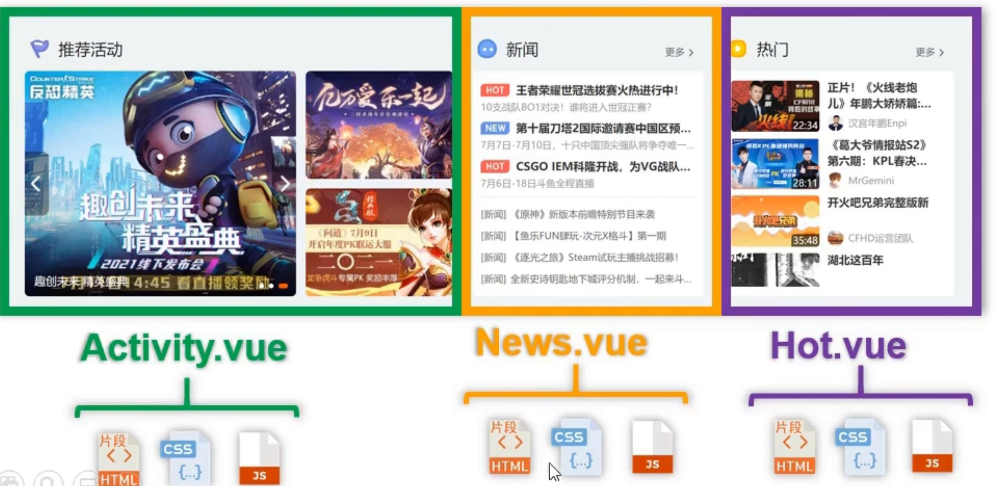
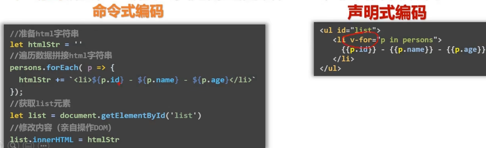
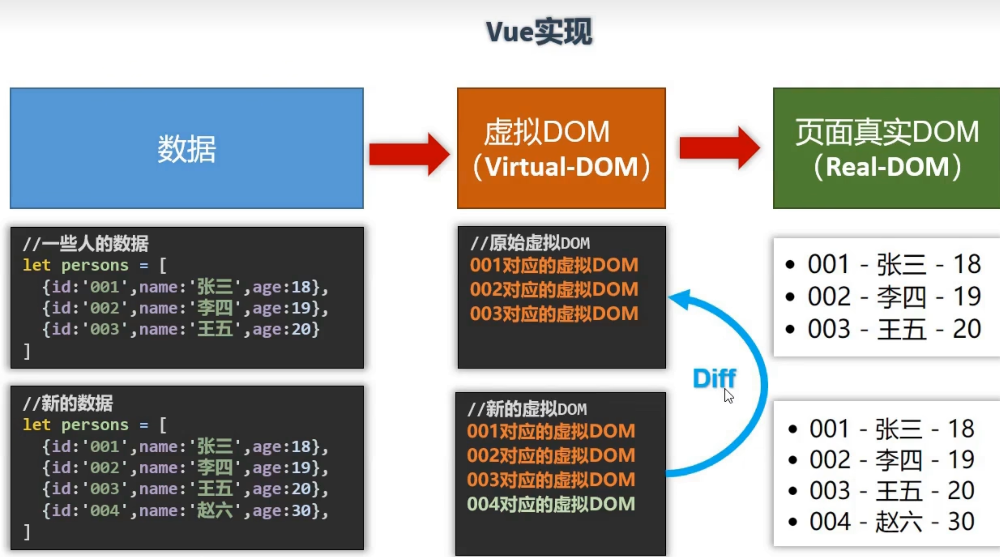
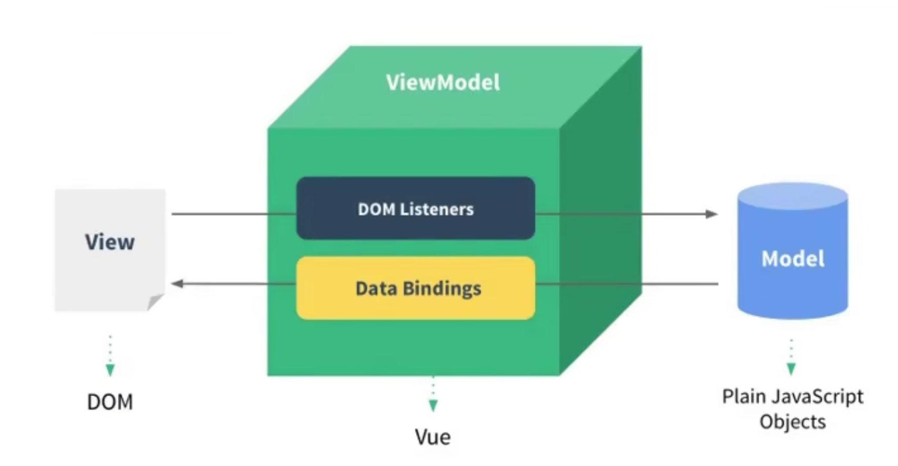
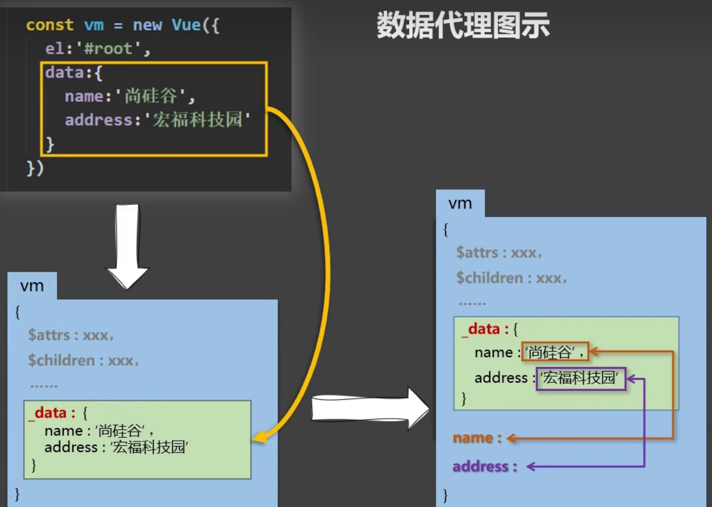

# Vue

Vue是一套用于`构建用户界面`的`渐进式`JavaScript框架

> 什么是渐进式? Vue可以自底向上逐层地应用; 当构建简单应用时, 只需一个轻量小巧的核心库; 当构建复杂应用时, 可以引入各式各样的`Vue插件`


Vue具有以下特点:

1. 采用==组件化==模式, 提高代码复用率且让代码更好维护



2. ==声明式==编码, 让编码人员无需直接操作DOM, 提高开发效率





3. 使用==虚拟DOM==+优秀的==Diff算法==, 尽量复用DOM节点




## Vue基础

### 初始Vue

1. 想让Vue工作, 就必须创建一个Vue实例, 且必须在使用构造函数时传入一个配置对象
2. root容器里面的代码依然符合html规范, 只不过加入了一些特殊的Vue语法, 这些Vue语法会被Vue解析
3. root容器里的代码被称为`Vue模版` 
4. Vue实例和容器是一一对应的, Vue实例会配合着组件一起使用
5. {{xxx}}中的xxx要写js表达式, 并且xxx可以自动读取到data中的所有属性
6. 一旦data中的数据发生变化, 那么页面中用到该数据的地方也会自动更新

```html
<!-- 容器 -->
<div id="root">
  <!-- 插值表达式 -->
  <h1>Hello, {{ name.toUpperCase() }}</h1>
</div>
<script>
Vue.config.productionTip = false
new Vue({
  el: '#root', // el用于指定当前的Vue实例为某个容器服务, 值通常为css选择器字符串
  data: {
    name: 'You'
  } // data中的数据为el所挂载的容器使用
}) // 参数为配置对象
</script>
```


### Vue模版语法

#### 插值语法

语法: `{{表达式}}`

作用: 用于解析==标签体==(\<a>文字内容是标签体</a>)内容

#### 指令语法

语法: `v-xxx:`

作用: 用于解析标签(包括: 标签属性、标签体内容、绑定事件……)

例如: 下列代码块中的href属性的值可以写js表达式, 因为**v-bind:**是一个vue指令语法, 会被vue解析

```html
<a v-bind:href='url'>去百度</a>
```


### 数据绑定

Vue中有两种数据绑定的方式:

1. 单向绑定(v-bind): 数据只能从data流向页面
2. 双向绑定(v-model): 数据不仅能从data流向页面, 还可以从页面流向data
   - 双向绑定一般应用在表单类元素上(如: input、select等)
   - v-model:value 可以简写成 v-model, 因为v-model默认收集的就是value值

```html
<input type="text" v-model:value="name">
<input type="text" v-model="name">
```


### **el**与**data**的两种写法

1. el的两种写法

写法一: new Vue的时候配置el属性

```javascript
new Vue({
  el: '#app'
})
```

写法二: 先创建Vue实例, 随后再通过原型对象中的$mount()指定

```javascript
let vm = new Vue()
vm.$mount('#app')
```


2. data的两种写法

写法一: 对象式

```javascript
new Vue({
  el: '#app',
  data: {
    key: 'value'
    // ...
  }
})
```

写法二: 函数式

```javascript
new Vue({
  el: '#app',
  data() {
  	return {
  		key: 'value'    
    }  
  }
})
```

用到Vue组件时, data必须使用函数式, 否则会报错. 

> 由Vue管理的函数, 一定不能写箭头函数, 一旦写了箭头函数, this就不再是Vue实例了


### MVVM模型

[MVVM](https://en.wikipedia.org/wiki/Model–view–viewmodel)是Model-View-ViewModel的缩写。

- `M`: 模型(Model), 也就是Vue实例中data对象里的数据部分
- `V`: 视图(View), 模版代码, 最终呈现给用户的内容
- `VM`: 视图模型(ViewModel), Vue实例, 用来将Model渲染到View中, 并监听View中的数据, 反馈给Model



> data中的所有属性, 最后都会出现在VM(vue实例对象)身上. 这些属性以及Vue原型上所有属性, 在Vue模版(即View)中都可以直接使用


### 数据代理

数据代理即通过一个对象代理对另一个对象中属性的操作(读/写), 下列代码块为proxy对象代理了target对象中的**b**属性. 可以通过proxy对象访问到target对象中的属性.

```javascript
const proxy = {}
// 被代理对象
const target = {
  b: 20
}
Object.defineProperty(proxy, 'b', {
  get() {
    return target.b
  },
  set(v) {
    target.b = v
  }
})
console.log(proxy.b); // 20
proxy.b = 2
console.log(proxy.b) // 2
console.log(target.b) // 2
```

`Vue中通过vm对象来代理data对象中的属性的读写. 这样做的好处是让用户更加方便地操作data中的属性.`

Vue实例中声明的data最终会被解析到`vm._data`中, 因为vm中声明的属性是可以在模版中直接访问; vue做了一层数据代理, 将_data中的属性代理到vm对象中, 使我们在模版中可以直接通过属性名获取值, 而不需要写 _data.属性名

```html
<!--如果没有数据代理-->
<h1>{{ _data.name }}</h1>
```

Vue数据代理的基本原理: 通过Object.defineProperty()把data对象中所有属性添加到vm上. 为每一个添加到vm上的属性都指定一个getter/setter. 在getter/setter内部去读写data中对应的属性.





### 事件处理

#### 事件的基本使用

1. 使用v-on:xxx 或 @xxx绑定事件, 其中xxx是事件名
2. 事件的回调需要配置在vm配置对象的methods对象中, 最后会在vm对象上
3. methods中配置的函数, 不要用箭头函数! 否则this就不是vm了
4. methods中配置的函数, 都是被Vue所管理的函数, this的指向是vm 或 `组件实例对象`
5. **@click=""和@click="demo($event)"效果一致, 但是后者可以传参**

```html
<div id="app">
<button v-on:click="showDialog()">点我弹出窗口</button>
<button @click="showDialog($event, 666)">点我弹出窗口</button>
</div>
<script>
new Vue({
  el: '#app',
  methods: {
    showDialog(event, value) {
      alert('hello')
      console.log(value) // 666
      console.log(event.target) // 事件源对象
    }
  }
})	
</script>
```


#### 事件修饰符

语法: `@事件名称.事件修饰符="方法名称($event, arg1, ...)"`

1. `prevent`: 阻止默认事件, 比如<a>标签的自动跳转等
2. `stop`: 阻止冒泡事件
3. `once`: 事件只触发一次. 比如按钮被点击一次后, 再次点击就不会调用回调函数
4. `capture`: 使用事件的捕获模式, 关闭冒泡模式
5. `self`: 只有event.target是当前操作的元素时才触发事件. 比如事件冒泡时, 外层的元素
6. `passive`: 事件的默认行为立即执行, 无需等待事件回调执行完毕. 比如鼠标滚轮的wheel事件, 需要等回调执行结束后, 才会有页面行为

```html
<div id="app">
	<!-- 1 .prevent 阻止默认行为 -->
	<a @click.prevent="show()" href="https://www.baidu.com">去百度</a>
	<!-- 2 .stop 阻止事件冒泡 -->
	<div @click="show()" class="outer">
		<div @click.stop="show()" class="inner">

		</div>
	</div>
	<!-- 3 .once 事件只触发一次 -->
	<button @click.once="show">只触发一次</button>
</div>
<script>
	new Vue({
		el: '#app',
		methods: {
			show() {
				alert('hello')
			}
		}
	})
</script>
```

事件修饰符也支持链式调用, 比如`@click.stop.prevent`就是先阻止冒泡再阻止默认行为


#### 键盘事件

语法: **@keyup.键盘事件别名="方法名()"**

```html
<input type="text" @keyup.enter="showInfo()" v-model:value="name">
```

Vue中常用的按键别名有: 

- 回车(enter)
- 删除或退格(delete)
- 退出(esc)
- 空格(space)
- 换行(tab): 比较特殊, 需要配合**keydown**使用
- 上、下、左、右(up、down、left、right)

Vue未提供别名的按键, 可以使用按键原始的key值来绑定, 但需要将原来的大驼峰转为短横线命名法.

一些系统修饰键如: `ctrl`、`alt`、`shift`、`meta`等如果要单独使用需要配合**keydown**来使用才可正常触发事件;  组合键就可以正常使用keyup. 组合按键写法为 `@keyup.ctrl.y`

想要自定义别名, 可以修改Vue配置项, **Vue.config.keyCodes.自定义键名=键码**


### 属性

#### 计算属性

> 什么是计算属性??? 当一个需要用的的属性不存在, 需要通过`已有的属性(data对象)`计算得来


原理: 其底层借助了Object.defineProperty()提供的getter和setter. 当数据被初次读取或当依赖的数据发生变化时计算属性的getter方法会被执行. 与methods来实现相比, 其内部有数据缓存机制, 多次读取不用重复计算, 效率更高, 调试也更加方便.


```html
<div id="app">
  姓: <input type="text" v-model="firstname"><br><br>
  名: <input type="text" v-model="lastname"><br><br>
  全名: <span>{{ fullName }}</span>
</div>
<script>
  new Vue({
    el: '#app',
    data: {
      firstname: '张',
      lastname: '三'
    },
    computed: {
      fullName: {
        get() {
          // 这里的this指向的是Vue实例
          return this.firstname + '-' + this.lastname
        },
        set(value) {
          let arr = value.split('-')
          this.firstname = arr[0]
          this.lastname = arr[1]
        }
      }
    }
  })
</script>
```

- `计算属性的 getter 应只做计算而没有任何其他的副作用`
- 计算属性最后也会出现在Vue实例对象上, 可以在插值表达式等直接读取
- 如果计算属性要被修改, 那必须写set函数去响应修改, 且set中要让其**依赖数据**改变
- 若计算属性不需要被修改, 即只有getter时, 该计算属性可以简写, 如下方代码块所示

```javascript
// 简写方式一: 直接把冒号后面的函数当getter
computed: {
  fullName: function () {
    return ''
  }
}

// 简写方式二: 直接写成方法
computed: {
	// 方法名就是计算属性名
  fullName() {
    return ''
  }
}
```


#### 监视属性

在有些情况下，我们需要在状态变化时执行一些“副作用”：例如更改 DOM，或是根据异步操作的结果去修改另一处的状态。这时我们就可以用到vue配置中的`watch`选项, 在每次响应式属性(包括计算属性)发生变化时, 都会触发一个回调函数.


```html
<div id="app">
  <h1>今天的天气很{{info}}</h1>
  <button @click="isHot = !isHot">切换</button>
</div>
<script>
  let vm = new Vue({
    el: '#app',
    data: {
      isHot: true
    },
    // 计算属性
    computed: {
      info() {
        return this.isHot ? '🥵' : '🥶'
      }
    },
    // 监视属性
    watch: {
      isHot: {
        // 初始化时让handler调用一次, oldVal为undefined
        immediate: true,
        handler(newVal, oldVal) {
          console.log(newVal, oldVal)
        }
      }
    }
  })
</script>
```

当初始化时没有添加监视属性时, 后续也可以通过Vue实例再添加:


```javascript
vm.$watch('isHot', {
  immediate: true,
  handler(newVal, oldVal) {
    // ...
  }
})
```

watch默认不监测对象内部值的改变(只要对象引用地址没变, 里面的属性变化不监测). 当配置监测属性时开启`deep:true`即可监测对象内部值改变. 使用watch时应该根据数据的具体结构, 再决定是否采用深度监视.

```javascript
// 只监测对象里的某个属性
vm.$watch('person.rich', {
  handler(newVal, oldVal) {
    // ...
  }
})

// 监测对象里的所有属性
vm.$watch('person', {
  deep: true, // 开启深度监测
  handler(newVal, oldVal) {
    // ...
  }
})
```

与计算属性类似, 当我们配置监视属性时, 如果只有一个handler(), 而其他都采用默认配置, 可以将代码简写:

```javascript
watch: {
  // 方法名就是被监视属性名
  isHot(newVal, oldVal) {
    
  }
}
```

#### 计算属性与监视属性的区别

1. 计算属性能完成的功能, 监视属性都可以完成
2. 监视属性能完成的功能, 计算属性不一定能完成. 例如: 监视属性可以进行异步操作.
3. `计算属性不能有“副作用”, 而监视属性通常就是用来产生副作用的`


> 所有被Vue所管理的函数, 最好写成普通函数, 这样this的指向才是vm 或 组件实例对象
>
> 所有不被Vue所管理的函数(定时器的回调、ajax的回调、Promise的回调等), 最好写成箭头函数, 这样this的指向才是vm 或 组件实例对象


### 绑定样式

使用Vue可以动态地绑定组件的样式

1. class样式

写法: `:class="xxx"` xxx可以是字符串、对象、数组

- 字符串适用于: 当类名不确定, 要动态获取时

- 数组适用于: 要绑定多个样式, 个数不确定, 名字也不确定
- 对象适用于: 要绑定多个样式, 个数确定, 名字也确定, 但不确定用不用

```html
<style>
  .basic{width: 200px;height: 100px;border: 1px solid black;}
  .pink {background-color: pink; color: #CF4444}
  .red {background-color: red; font-size: 20px}
  .green {background-color: green; font-weight: bolder}
</style>

<div id="app">
  <!-- 1.字符串写法, mood的是字符串.类名不确定,需要动态变换 -->
  <div class="basic" :class="mood" @click="changeMood()"></div>
  <!-- 2.数组写法, 要绑定的样式个数不确定, 名字不确定 -->
  <div class="basic" :class="moodArr">{{ username }}</div>
  <!-- 3.对象写法,要绑定的样式个数确定、名字也确定,但是动态决定用不用 -->
  <div class="basic" :class="moodObj">{{ username }}</div>
</div>
<script>
  new Vue({
    el: '#app',
    data: {
      username: 'hello world',
      mood: 'pink',
      moodArr: ['pink', 'red', 'green'],
      // key为类名, value为boolean
      moodObj: {pink: true, red: false}
    },
    methods: {
      changeMood() {
        this.mood = 'red'
      }
    }
  })
</script>
```


2. style样式

写法一: `:style="{fontSize: xxx}"`其中xxx是动态值 

写法二: `:style="[a, b]"`, 其中a、b时样式对象, 对象中必须写css样式的属性. 不能写错


```html
<!-- 1.绑定对象, 对象中的键值对为css属性和值 -->
<div class="basic" :style="styleObj">{{ username }}</div>
<!-- 2.绑定数组, 数组中可以是多个对象 -->
<div class="basic" :style="styleArr">{{ username }}</div>
```


### 渲染

#### 条件渲染

1. `v-if`

写法: **v-if="表达式"**、v-else-if="表达式"、v-else

适用于切换频率较低的场景, 不展示的DOM会直接被移除, 不会出现在DOM树中. 


2. `v-show`

写法: **v-show="表达式"**

适用于切换频率较高的场景. 不展示的DOM元素不会被移除, 仅仅是隐藏了而已


> <template>标签上只能使用**v-if**指令


#### 列表渲染

语法: `v-for="(item, index) in xxx" :key="yyy"`, xxx部分可以为数组、对象、字符串、数字(指定次数)

在使用`v-for`指令遍历时, key是非常重要的. key是虚拟DOM对象的标识, 当数据发生变化时, Vue会根据`新数据`生成`新的虚拟DOM`,随后Vue进行新虚拟DOM与旧虚拟DOM的差异比较, 比较规则如下:

- 旧虚拟DOM中找到了与新虚拟DOM相同的key:
  - 若虚拟DOM中内容没变, 直接使用之前的真实DOM
  - 若虚拟DOM中内容变了, 则生成新的真实DOM, 随后替换掉页面中之前的真实DOM
- 旧虚拟DOM中未找到与新虚拟DOM相同的key
  - 创建新的真实DOM, 随后渲染到页面


在开发中最好使用每条数据的唯一标识作为key.  通常情况下, 如果key仅用于渲染列表展示, 使用index作为key也是没有问题的. 但是如果存在对数据的`逆序添加`、逆序删除等破坏顺序操作, 可能会产生没有必要的真实DOM更新. 当结构中还包含输入类的DOM时, 还会产生错误的DOM更新.


```html
<div id="app">
<ul>
  <!-- 如果不指定key, 则默认为index, 通常必须指定key为数据的唯一标识 -->
  <li v-for="(person, index) in people" :key="person.id">{{person.username}}-{{person.age}}</li>
</ul>
</div>
<script>
new Vue({
  el: `#app`,
  data: {
    people: [
      {id:1, username: 'lin', age: 18},
      {id:2, username: 'you', age: 18},
    ]
  }
})
</script>
```


#### Vue监视数据的原理

vue会监视data中所有层次的数据.


1. 如何监测对象中的数据?

通过setter实现监视，且要在new Vue时就传入要监测的数据。

- 对象中后追加的属性，Vue默认不做响应式处理
- 如需给后添加的属性做响应式，请使用如下API：

```javascript
Vue.set(target，propertyName/index，value)
vm.$set(target，propertyName/index，value)
```

2. 如何监测数组中的数据？

通过`包裹`数组更新元素的方法实现，在原型链上会先找到Vue重写过的一些数组方法. 本质就是做了两件事：

- 调用原生对应的方法对数组进行更新
- 重新解析模板，进而更新页面


> 在Vue修改数组中的某个元素一定要用如下方法：
>
> - 使用这些API:push()、pop()、shift()、unshift()、splice()、sort()、reverse() 
> - `Vue.set() 或 vm.$set()`


Vue.set() 和 vm.$set() 不能给vm 或 vm 的根数据对象(vm._data) 添加属性！！


`在操作数组时, 需要注意的是如果是修改数组中元素对象的属性, 则默认就能被监视. 不能被监测的是直接修改数组下标上的元素`


```javascript
<div id="app">
  <button @click="addAge()">年龄+1岁</button>
  <br>
  <button @click="addSex()">添加性别属性, 默认值:男</button>
  <br>
  <button @click="addFriend()">在列表首位添加一个朋友</button>
  <br>
  <button @click="modFriendName()">修改第一个朋友的名字:张三</button>
  <br>
  <button @click="addHobby()">添加一个爱好</button>
  <br>
  <button @click="modFirHobby()">修改第一个爱好: 开车</button>


  <h1>学生信息</h1>
  <h3>name: {{ student.name }}</h3>
  <h3>age: {{ student.age }}</h3>
  <h3 v-if="student.gender">sex: {{ student.gender }}</h3>
  <h3>hobby: </h3>
  <ul>
    <li v-for="(h,index) in student.hobby" :key="index">{{ h }}</li>
  </ul>
  <h3>friends:</h3>
  <ul>
    <li v-for="(f, index) in student.friends" :key="index">
      {{ f.name }}--{{ f.age }}
    </li>
  </ul>
</div>

<script>
  new Vue({
    el: '#app',
    data: {
      student: {
        name: 'you',
        age: 18,
        hobby: [
            '抽烟', '喝酒', '烫头'
        ],
        friends: [
          {
            name: 'lin',
            age: 18
          },
          {
            name: 'wang',
            age: 19
          }
        ]
      }
    },
    methods: {
      addAge() {
        this.student.age++
      },
      addSex() {
        this.$set(this.student, 'gender', '男')
      },
      addFriend() {
        this.student.friends.unshift({name: 'chen', age: 20})
      },
      modFriendName() {
        this.student.friends[0].name = 'san'
      },
      addHobby() {
        this.student.hobby.push('ping')
      },
      modFirHobby() {
        this.$set(this.student.hobby, 0, 'car')
      }
    }
  })
</script>
```


### 收集表单数据

指令: `v-model`

当表单控件类型不同的时候, v-model的具体用法如下:

- **type="text"**: 收集的是value值, 用户输入的就是value值

- **type="radio"**: 收集的是value值, 且必须要给标签配置value值

- **type="checkbox":** 
  - 没有配置value属性时: 收集的就是checked, 值为true或者false
  - 配置了value属性时: 
    - 如果v-model的初始值是数组, 收集的就是value组成的数组
    - 如果v-model的初始值不是数组, 则收集的就是checked. 也就是boolean


> v-model有三个修饰符: `lazy(失去焦点再收集)`、`number:转为数字类型`、`trim:首尾空格去除`


```html
<div id="app">
<form @submit.prevent="submit()">
  账号: <input type="text" v-model="student.username"><br>
  密码: <input type="password" v-model="student.password"><br>
  性别: 男<input type="radio" value="male" v-model="student.gender">
  女 <input type="radio" value="female" v-model="student.gender"><br>
  爱好: 学习 <input type="checkbox" value="learn" v-model="student.hobby">
  打游戏 <input type="checkbox" value="play" v-model="student.hobby">
  吃饭 <input type="checkbox" value="eat" v-model="student.hobby"> <br>
  所属校区:
  <select v-model="student.city">
    <option value="beijing">北京</option>
    <option value="shanghai">上海</option>
  </select><br>
  <button>提交</button>
</form>
</div>

<script>
new Vue({
  el: '#app',
  data: {
    student: {
      username: '',
      password: '',
      gender: 'male',
      hobby: ['learn', 'play'],
      city: ''
    }
  },
  methods: {
    submit() {
      console.log(this.student)
    }
  }
})
</script>
```


### 过滤器

当要对显示的数据进行特定格式化后再显示(适用于一些简单逻辑的处理)

过滤器的注册:

```javascript
// 全局过滤器
Vue.filter(name, callback)
// 局部过滤器
new Vue({
  filters: {
    
  }
})
```

使用过滤器

```javascript
{{ xxx | 过滤器名称 }}
// 也可用于v-bind
v-bind:属性 = "xxx | 过滤器名"
```


- 过滤器也可以接收额外参数, 多个过滤器也可以串联
- 使用过滤器并没有改变原本的数据, 而是产生新的对应的数据

```html
<!-- 串联使用 -->
<h3>formatted: {{ timestamp | fmtTime('YYYY-MM-DD HH:mm:ss') | slice}}</h3>
```


### 指令

#### 内置指令

1. v-text指定

作用: 向其所在的节点中渲染文本内容

与插值语法相比, v-text会替换掉节点中的内容, 而{{xx}}则不会

```html
<!-- hello会被变量name的值替换 -->
<h3 v-text="name">hello</h3>
```

2. v-html指令

作用: 向指定节点中渲染包含html结构的内容

> v-html有严重的安全性问题!!! 在网站上动态渲染任意HTML是非常危险的, 容易导致XSS攻击. 一定要在可信的内容上使用v-html, 永远不要用在用户提交的内容上!!!


3. v-cloak(没有值)

- 本质上是一个特殊属性, Vue实例创建完毕并接管容器后, 会删掉v-cloak属性
- 使用css配合`v-cloak`可以解决网速慢时页面展示出{{xxx}}的问题

```html
<style>
  /*属性选择器*/
  [v-cloak] {
    display: none;
  }
</style>
<h3 v-cloak>{{ name }}</h3>
```


4. v-once指令

- `v-once`所在节点的初次动态渲染后, 就视为静态内容了
- 之后数据的改变不会引起v-once所在结构的更新, 可以用于优化性能

```html
<div id=root>
  <!-- 之后n就算改变了, 这里的值也不会再渲染了 -->
  <h2 v-once>
    初始化时n的值为:{{n}}
  </h2>
</div>
```


5. v-pre指令

`v-pre`可以跳过其所在节点的编译过程. 可以利用该属性跳过没有使用指令语法、没有使用插值表达式语法的节点, 这样会加快编译速度.


> `preserve`: 保留


#### 自定义指令

1. 局部指令

```javascript
new Vue({
  directives: {
    '指令名': {
      // 指令与元素成功绑定
      bind(element, binding) {
        // ...
      },
      // 指令所在元素被插入页面时(真实DOM)
      inserted(element, binding) {
        // ...
      },
      // 模板被重新解析
      update(element, binding) {
        // ...
      }
    }
  }
})
```

写法二: 

```javascript
new Vue({
  directives{
  	// bind和update方法, 没有insertd钩子
  	'指令名'() {
  	
		}
	}
})
```

> 全局指令的写法: Vue.directive(指令名, 配置对象/回调函数)


- 指令定义时不加`v-`, 但是使用时要加
- 指令名如果是多个单词, 要使用短横线连接方式, 不要使用小驼峰
- **指令中函数的this指向的都是window对象, 不再是Vue实例**


```html
<div id="app">
	<h3>n原来为{{ n }}</h3>
	n扩大10倍后, 值为
  <h3 v-big="n"> </h3>
</div>
<script>
new Vue({
  el: '#app',
  data: {
    n: 10
  },
  directives: {
    big(ele, binding) {
      console.log(binding)
      ele.innerText = binding.value * 10
    }
  }
})
</script>
```
