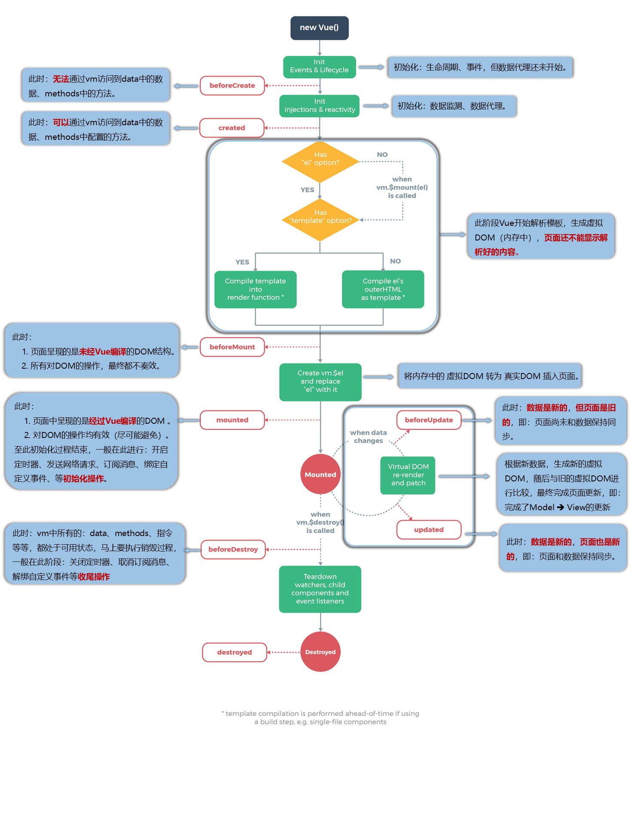
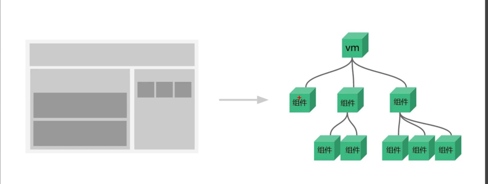
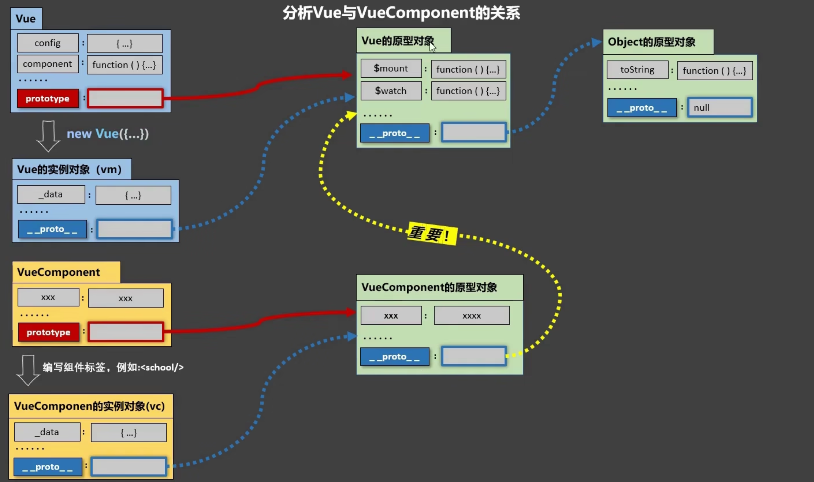
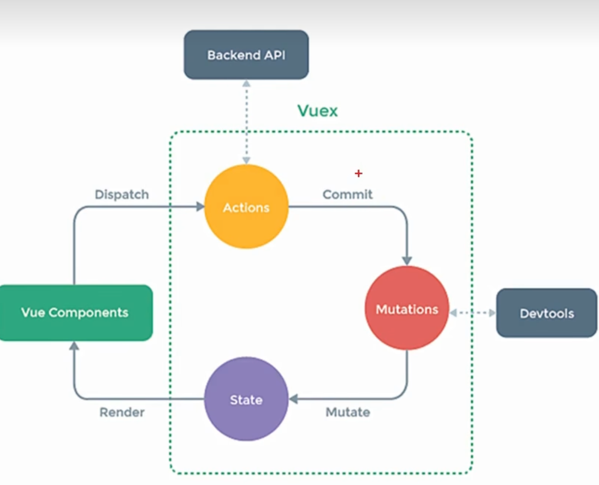
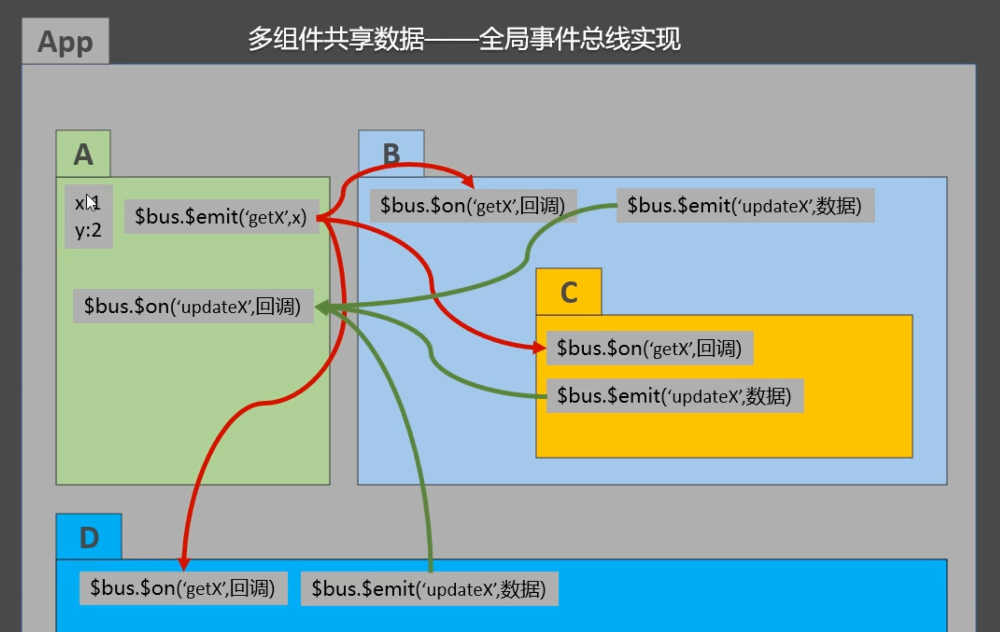
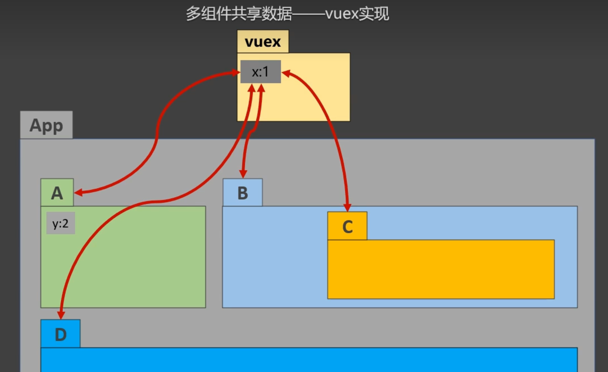

## Vue高级

### Vue生命周期

生命周期又称为生命周期回调函数、生命周期函数、生命周期钩子, 是Vue在运行过程中的关键时刻帮我们调用的一些指函数, 生命周期函数名字不可修改, 其中的this指向的是`vm或组件实例对象`.


常用的生命周期钩子:

- ==mounted==: 发送ajax请求、启动定时器、绑定自定义事件、订阅消息等`初始化操作`
- ==beforeDestroy==: 清除定时器、解绑自定义事件、取消订阅消息等`收尾工作`




关于销毁Vue实例

- 销毁后借助Vue开发者工具开不到任何信息
- `销毁后自定义事件会失效, 但原生DOM事件依然有效`
- 一般不会在beforeDestroy操作数据, `因为即便操作数据, 也不会再触发更新流程了`


### 组件

组件的定义——实现应用中`局部`功能`代码和资源`的`集合`, 使用组件化可以复用代码, 简化项目编码, 提高运行效率


- 模块化: 当应用中的js都以模块来编写的, 那这个应用就是一个模块化的应用
- 组件化: 当应用中的功能都是多组件的方式来编写的, 那这个应用就是一个组件化的应用





通过`Vue.extend(options)`可以创建一个组件, 其中options和new Vue(options)时传入的options几乎一样, 但也有点区别:

- `el`不能写, 最后所有的组件都要经过一个vm的管理, 由vm中的el决定服务于那个容器
- data必须写成函数, 因为组件通常都是复用的, 数据存在引用关系


注册组件的方式分为:

1. 局部注册: 通过new Vue时传入`components`选项
2. 全局注册: 通过`Vue.component('组件名', 组件)`


```html
<div id="app">
  <!-- 3. 使用组件 -->
  <school></school>
</div>
<script>
  // 1. 声明一个组件 可以不写Vue.extend, 直接写对象
  const school = Vue.extend({
    template: `
      <div>
        <h1>{{ name }}</h1>
        <h1>{{ address }}</h1>
      </div>
    `,
    data() {
      return {
        name: 'putian',
        address: 'fujian'
      }
    }
  })

  new Vue({
    el: '#app',
    // 2. 注册组件
    components: {
      school
    }
  })
</script>
```

> 使用Vue组件时, 大驼峰式(<MySchool/>)的组件或单标签的写法都需要Vue脚手架支持.


Vue组件本质上是一个名为`VueComponent`的构造函数, 通过`Vue.extend()`生成的, 不同类型的组件对应的VueComponent构造函数不同(虽然名字都是同一个).  当我们使用组件时, 即在模板中声明`<school></school>`后, Vue解析时会帮我们创建school组件的实例对象. 也就是`new VueComponent(options)`


关于this指向问题

- 组件配置中: data函数、methods中的函数、watch中的函数、computed中的函数都是`VueComponent实例对象`
- new Vue(options)配置中: data函数、methods中的函数、watch中的函数、computed中的函数都是`Vue实例对象`


> ==VueComponent.prototype.\__proto__ \=\== Vue.prototype==

`有个如上的关系, 才能让组件实例对象可以访问到Vue原型上的属性、方法`, 如图:





#### 组件标识`ref`

`ref`被用来给元素或者子组件注册引用信息(id的替代者). 当ref应用在html标签上时, 获取的时真实DOM元素, 当应用在组件标签上时则是`组件实例对象`.


使用方式:

- 声明标识

```html
<h1 ref="xxx">...</h1>
<School ref=""></School>
```

- 获取组件

```javascript
this.$refs.xxx //xxx为ref的值
```

例如:

```javascript
<School ref="school"></School>

export default {
  name: 'App',
  components: {
    School
  },
  methods: {
    showInfoApp() {
      console.log(this.$refs.school);
    }
  }
}
```


#### 组件通信`props`

功能: 让组件接收外部传过来的数据(`可以是函数`)

语法: 使用组件时: <Demo name="xxx" key2=value2 key3=value3/>

​	  组件定义时:

写法一: 简单接收声明接收——数组

```javascript
new Vue({
  props: ['name', 'key2', 'key3']
})
```


写法二: 接收的同时对数据进行类型限制 简单对象

```javascript
new Vue({
  props: {
    name: String,
    age: Number
  }
})
```


写法三: 接收的同时对数据进行类型限制 复杂对象, 默认值指定+必要性限制+类型限制

```javascript
new Vue({
  props: {
    name: {
      type: String,
      // required: false,
      default: 'wang'
    }
  }
})
```


> props是只读的, Vue会监测对props的修改, 如果进行了修改, 就会发出警告. 若业务需求确实需要修改, 那么需要复制props的内容到data中一份, 然后去修改data中的数据即可


#### 混入`mixin`

功能: 可以把多个组件公用的配置提取成一个混入对象

- 定义混合

```javascript
// 定义一个混入js文件并导出对象
export const mixin = {
    methods: {
        showInfo() {
            alert(this.name)
        }
    }
}
```


- 使用混入

```javascript
// 1.导入混入
import {mixin} from "@/mixin";
// 2.使用混入(局部混入)
new Vue({
  mixins: ['mixin']
})
```

```javascript
// 全局混入
Vue.mixin(xxx)
```


混入即将内容与组件内的内容合并, 当`data`产生冲突时, 会以组件内部声明的为主. vue的声明周期函数也可以使用混入, 这时会先调用混入的生命周期函数, 然后才调用组件内部的.


#### 插件`plugins`

插件可以增强Vue, 其本质是包含`install`方法的一个对象, install的第一个参数是`Vue`, 第二个以后的参数是插件使用者传递的自定义参数.


- 定义插件

```javascript
对象.install = function(Vue, options) {
  // 1. 添加全局过滤器
  Vue.filter(...)
  // 2. 添加全局指令           
  Vue.directive(...)
  // 3. 配置全局混入(合)
  Vue.mixin(...)
  // 4. 添加实例方法
  Vue.prototype.$myMethod = function() {...}
  Vue.prototype.$myProperty = xxx
}
```

- 使用插件

```javascript
import plugins from ''
Vue.use('plugins', 'xx', 'xxx')
```


#### 组件化编码流程

1. 拆分静态组件: 组件要按照功能点拆分, 命名不能跟html元素冲突
2. 实现动态组件: 需要考虑数据的存放位置, 数据是一个组件在用, 还是多个组件在用
    - 一个组件在用: 放在组件自身即可
    - 多个组件共用: 放在组件共同的父组件上(`状态提升`)
3. 实现交互: 从绑定事件开始


[案例: 组件化编码TODO](https://github.com/linqibin0826/javascript-2024/tree/master/Vue/20240202/todos)


当数据在多个组件共用时, 会涉及组件的通信问题, `props`配置项适用于父子组件之间的通信, 这个通信是双向的, 既可以父传子, 也可以子向父组件传递信息(`父组件传递函数给子组件`)


> 使用v-model时, v-model绑定的值不能时props传递过来的值, 因为props是不可以修改的, 它是只读的


#### 组件的自定义事件

组件的自定义事件是一种组件之间通信的方式, 适用于`子组件向父组件传递信息`.

使用场景: **A是父组件, B时子组件, B想给A穿数据, 那么就要在A中给B绑定自定义事件(事件的回调函数在A中)**


1. 绑定自定义事件的两种方式(在使用到该组件的组件上绑定):

```html
<!-- 方式一 -->
<Demo @testEvent='func'/>
<Demo v-on:testEvent='func'/>  
```

```javascript
// 方式二
<Demo ref='demo'/>
  
mounted() {
  this.$refs.demo.$on('testEvent', this.func)
}
```


> 若只想让自定义事件只能触发一次, 可以使用`once`修饰符, 或者方式二中`$on换成$once`


2. 触发自定义事件(在子组件中触发):

```javascript
this.$emit('eventName', 参数)
```

3. 解绑自定义事件:

```javascript
this.$off('eventName') // 解绑一个事件
this.$off(['eventName1', 'eventName2']) // 解绑多个事件
this.$off() // 解绑所有事件
```


组件上也可以绑定原生DOM事件, 需要使用`native`修饰符


> 通过`this.$ref.xxx.$on('eventName', func)`绑定自定义事件时, 回调要配置在`methods`中, 要么使用箭头函数, 否则this指向会有问题


#### 全局事件总线

全局事件总线是一种组件之间通信的方式, 适用于`任意组件之间通信`


1. 安装全局事件总线

```javascript
new Vue({
  // ...
  beforeCreate() {
    Vue.prototype.$bus = this // 安装全局实现总线, ¥bus就是当前正在创建的vm
  }
})
```


2. 使用事件总线

- 接收数据: A组件想要接收数据, 则在A组件中给$bus绑定自定义事件, 事件的`回调留在A组件自身`

```javascript
methods: {
  // 声明回调
  demo(param) {
    // ..
  }
}
mounted() {
  this.$bus.$on('xxx', this.demo)
}
```

- 提供数据

```javascript
this.$bus.$emit('xxxx', 数据)
```


> 在beforeDestroy钩子中, 记得使用*$off*去`解绑当前组件所用到的事件`


#### 消息订阅与发布

消息订阅发布也是一种组件间通信的方式, 适用于`任意间组件的通信`


1. 安装`pubsub`库:

```javascript
npm i pubsub-js
```

2. 引入模块

```javascript
import pubsub from 'pubsub-js'
```

3. 订阅消息: A组件向接收数据, 则在A组件中订阅消息, 订阅的回调留在A组件自身

```javascript
methods: {
  // 第一个参数是消息名称, 第二个开始才是真正的参数
  demo(msgName, data) {
    //...
  }
}
mounted() {
  this.pid = pubsub.subscribe('xxx', this.demo) // 订阅消息
}
```

> 发布订阅消息并不是Vue中的内容, 因此直接写普通函数时, `this并不是vm实例对象`, 此时可以写成箭头函数, 或者在`methods中声明的函数`


4. 发布消息

```javascript
pubsub.publish('xxx', 数据)
```

5. `取消订阅`

```javascript
beforeDestroy: {
  pubSub.unsubscribe(pid)
}
```


#### `$nextTick`

语法: `this.$nextTick(回调函数)`

作用: 在下一次DOM更新结束后执行其指定的回调


> 当数据改变后, 要基于更新后的新DOM进行某些操作时, 要在nextTick所指定的回调函数中执行


### 插槽

作用: 让父组件可以向子组件指定位置插入`html结构`, 也是一种组件间通信的方式, 适用于`父组件 => 子组件`


1. 默认插槽

```html
<!-- parent -->
<Category>
  <div>html...</div>
</Category>
```

```html
<!-- child -->
<template>
	<div>
    <!-- define slot -->
    <slot>default content</slot>
  </div>
</template>
```


2. 具名插槽

```html
<!-- parent -->
<Category>
	<template slot='center'>
  	<div>
      html tag
    </div>
  </template>
  <template v-slot:footer>
  	<div>
      html tags
    </div>
  </template>
</Category>
```

```html
<!-- child -->
<template>
	<div>
    <slot name='center'>defaut content</slot>
    <slot name='footer'>defaut content</slot>
  </div>
</template>
```


3. 作用域插槽

```html
<!-- parent -->
<Category>
  <!-- receive data here -->
	<template scope='scopeData'>
    <!-- ul -->
  	<ul>
      <li v-for='g in scopeData.games' :key='g'>{{ g }}</li>
    </ul>
  </template>
</Category>

<Category>
	<template scope='scopeData'>
    <!-- ol -->
  	<ol>
      <li v-for='g in scopeData.games' :key='g'>{{ g }}</li>
    </ol>
  </template>
</Category>
```

```html
<!-- child -->
<template>
	<div>
    <!-- scope slot -->
    <slot :games="games"></slot>
  </div>
</template>

<script>
	export deafault{
    name: 'Category',
    data() {
      // 数据在子组件中, 结构由使用者决定
      return {
        games: ['game1', 'game2']
      }
    }
  }
</script>
```

> `数据在组件自身, 但根据数据生成的结构需要组件的使用者来决定时才使用作用域插槽`


### Vuex

Vuex时专门在Vue中实现`集中式状态(数据)`管理的一个Vue`插件`, 对vue应用中多个组件的共享状态进行集中式的管理(读/写), 也是一种组件间通信的方式, 且适用于任意组件间的通信





1. 多组件共享数据——全局事件总线

当涉及组件太多, 全局事件总线实现共享数据就很麻烦了.




2. 多组件共享数据——vuex实现

- 多个组件依赖于同一状态
- 来自不同组件的行为需要变更同一状态




#### vuex基本使用

1. 创建配置文件: `src/store/index.js`

```javascript
import Vue from "视频笔记/前端/Vue/VueJunior"
import Vuex from "vuex"

// 应用vuex插件, 无法在App.vue中使用Vuex, 模块里的代码会先被执行, 然后才Vue.use
Vue.use(Vuex)

// 用于响应组件中的动作(业务逻辑)
const actions = {}
// 用于操作数据(方法名通常大写)
const mutations = {}
const state = {}

export default new Vuex.Store({
   actions, mutations, state
})

```

2. 使用store

```javascript
import store from "@/store";

export default {
  name: 'App',
  components: {
    HelloWorld,
    store
  }
}
```

3. actions中的参数

```javascript
// 第一个参数为上下文对象, 包含了dispach和commit等对象, 第二个为值
oddAdd(context, value) {
  if (context.state.sum % 2) context.commit('ADD', value)
}
```

4. mutations中的参数

```javascript
// 真正操作state的地方, 第一个参数为state对象
ADD(state, value) {
   state.sum += value
}
```

> 若没有网络请求或其他业务逻辑, 组件中也可以越过actions, 即不写`dispatch` 直接编写`commit`


#### getters配置项

当state中的数据需要加工后再使用时(`逻辑复杂, 并且需要复用时`), 可以使用getters加工.


1. 在`store.js`中追加`getters`配置

```javascript
const getters = {
  // 第一个参数就是数据源
  bigSum(state) {
    return // ...
  }
}
```

2. 组件中读取数据

```javascript
$store.getters.bigSum
```

> 可以将state和getters类比为vue中的data和computed之间的关系


#### Vuex的四个map方法的使用

1. `mapState方法`: 用于映射`state`中的数据为计算属性

```javascript
import { mapState } from Vuex

computed: {
  // 借助mapState生成计算属性: 对象写法
  ...mapState({ add:'add'})
  // 数组写法
  ...mapState(['add'])
}
```

2. `mapGetters方法`: 映射`getters`中的数据为计算属性

```javascript
computed: {
  ...mapGetters({bigSum:'bigSum'})
  // 数组写法
  ...mapGetters(['bigSum'])
}
```

3. `mapActions方法`: 用于在组件中生成与`actions` 对话的方法, 即包含`$store.dispatch(xxx)`的函数

```javascript
methods: {
  ...mapActions({ incrementOdd: 'incrementOdd', incrementWait:'incrementWait'})
  // 数组写法
  ...mapActions(['incrementOdd', 'incrementWait'])
}
```

4. `mapMutations方法`: 用于生成在组件中与`mutations`对话的方法, 即包含`$store.commit(xxx)`的函数

```javascript
methods: {
  ...mapMutations({increment: 'INCREMENT', decrement:'DECREMENT'})
  // 数组写法
  ...mapMutations('INCREMENT', 'DECREMENT')
}
```

> `mapActions`与`mapMutations`使用时, 若需要传递参数, 在模板中绑定事件时需要传递好参数, 否则参数时事件对象


#### 模块化与命名空间

可以将一类功能的配置项放到一个对象中, 并用命名空间将其标识

```javascript
const countAbout = {
  namespaced: true,
  state: { x: 1},
  mutations: {...},
  actions: {...},
  getters: {...}
}
            
const personAbout = {
	namespaced: true,
  state: { x: 1},
  mutations: {...},
  actions: {...},
  getters: {...}       
}

new Vuex.Store({
	modules: {
  	countAbout,
    personAbout       
  }            
})            
```

1. 开启命名空间后, 组件中读取state数据:

```javascript
// 方式一:
this.$store.state.personAbout.x
// 方式二:
...mapState('namespace', ['x'])
```

2. 读取getters数据

```javascript
// 方式一:
this.$store.getters['personAbout/firstPersonName']
// 方式二:
...mapGetters('countAbout', ['bigSum'])
```

3. 组件中调用`dispatch`

```javascript
// 方式一
this.$store.dispatch('personAbout/xxx')
...mapActions('countAbout', ['xxx'])
```

4. 组件中调用`commit`

```javascript
// 方式一
this.$store.commit('personAbout/xxx', value)
...mapMutations('countAbout', ['xxx'])
```


### 路由

一个路由(`route`)就是一组映射关系, 多个路由需要路由器(`router`)进行管理


#### 路由的基本使用

1. 安装vue-router, 命令: `npm i vue-router`

2. 应用插件: `Vue.use(VueRouter)`
3. 配置路由

```javascript
import VueRouter from 'vue-router'

export default new VueRouter({
  routes: [
    {
      name: 'xxx', // 路由命名(使用路由时方便编码)
      path: '/about',
      component: About,
      children: [
        {
          path: 'news', // 此处路由不需要再写’/‘
          component: News
        }
      ]
    },
    // ...
  ]
})
```

4. 实现切换路由(`active-class`可配置高亮样式)

```html
<router-link active-class='active' to='/about'>About</router-link>
```

> 路由跳转时, `to`属性还能写成对象形式, 如果路由有name属性, 可以不写路径, 通过name也能跳转


5. 指定展示位置

```html
<router-view></router-view>
```


几个注意点

- 路由组件通常放在`pages`文件夹, 一般组件通常存放在`components`文件夹
- 通过切换, “隐藏”了的路由组件, 默认是被销毁的, 需要的时候会重新挂载
- 每个组件都有自己的`$route`属性, 里面存储着自己的路由信息
- 整个应用只有一个router, 可以通过组件的`$router`属性获取到


#### 路由传参

##### 通过query传参

1. 传递参数

```html
<!-- 方式一:字符串写法 -->
<router-link :to='/home/message/detail?id=xxx&title=xxx'></router-link>

<!-- 方式二:对象写法 -->
<router-link :to='{
                  path: `/home/message/detail`,
                  query: {
                  	id: xxx,
                  	title: xxx
                  }
                  }'
```


2. 接收参数

```javascript
$route.query.xxx
```


##### 通过params传参

1. 配置路由, 声明接收params参数

```javascript
new VueRouter({
  path: '/home',
  component: Home,
  children: [
    {
      path: 'news/:id/:title', //使用占位符声明接收params参数
      component: News
    }
  ]
})
```


2. 传递参数

```html
<router-link :to='/home/message/detail/xxx/xxx'></router-link>
```

> 路由携带params参数时, 如果使用to的对象写法, 则不能使用path配置项, `必须使用name配置!`


##### 路由的props配置

通过配置props配置项可以使组件更方便地接收路由参数

```javascript
{
  name: 'route1',
  path: '/detail/:id',
  component: Detail,
  // 第一种写法: props值为对象, 该对象中所有的k-v最终都会通过props传给detail组件
  props: {a:900}
  // 第二种写法: boolean, 把路由中的所有params参数通过props传给Detail组件
  props: true
  // 第三种写法: props值为函数, 会把函数返回的对象的所有k-v通过props传给Detail组件
  props(route) {
    return {
      id: route.query.id,
      title: route.query.title
    }
  }
}
```


#### \<router-link>的replace属性

浏览器的历史记录有两种写入方式分别是`push`和`replace`, push是追加历史记录, replace则是替换当前记录. 路由跳转时候默认是push. 可以通过以下配置开启`repalce`模式

```html
<router-link replace ...>News</router-link>
```


#### 编程式路由导航

编程式路由可以不借助`<router-link>`实现路由跳转, 让路由跳转更加灵活

```javascript
this.$router.push({
  name: 'path',
  params: {
    id: xxx,
    title: xxx
  }
})

this.$router.replace({
  name: 'path',
  params: {
    id: xxx
  }
})

this.$router.back()
this.$router.forward()
this.$router.go(3) // 正数前进, 负数后退
```


#### 缓存路由组件

让不展示的路由组件保持挂载, 不被销毁. `缓存多个组件可以写数组`

```html
<!-- 要写组件名称 --> 
<keep-alice include="News">
	<router-view></router-view>
</keep-alice>
```

#### 两个新的生命周期钩子

路由组件独有的两个钩子, 用于捕获路由组件的激活状态

1. `activated`: 路由组件被激活时触发
2. `deactivated`: 路由组件失活时触发


#### 路由守卫

路由守卫可以对路由进行权限控制, 包括全局守卫、独享守卫、组件内守卫.

```javascript
// 前置全局守卫 初始化时执行、每次路由切换前执行
router.beforeEach((to, from, next) => {
  if(to.meta.isAuth) {
    if(condition) {
      next() // 满足条件放行,
    }
  }
})

// 后置
router.afterEach((to, from) => {
  if(to.meta.title) {
    // ...
  }
})

// 独享守卫, 在具体的路由配置项中配置
beforeEnter(to, from, next) {
  
}
```

