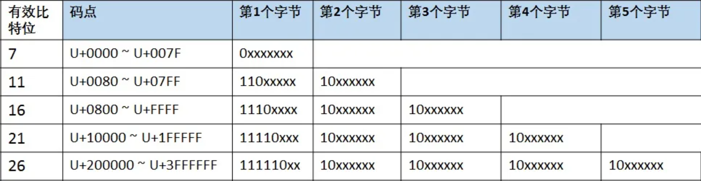
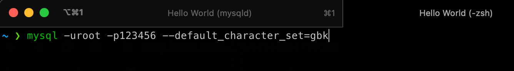

# MySQL字符集和比较规则

## 字符集和比较规则简介

> `字符集`： 描述字符与二进制数据的映射关系
>
> `比较规则`：比较指定字符集中的字符的规则

### 字符集

我们知道，计算机无法直接存储字符串，实际存储的都是二进制数据。字符集是有限的，也就是字符范围，比如ASCII字符集包含了128个字符与进制数据的**映射关系**。**将字符根据编码规则映射成二进制数据的过程叫做`编码`，将二进制数据根据编码规则映射到字符的过程叫做`解码`。**


举个例子，在ASCII字符集中，存在如下映射关系：

```javascript
'A' -> 01000001(十六进制为0x41)
'B' -> 01000010(十六进制为0x42)
'a' -> 01100001(十六进制为0x61)
'b' -> 01100010(十六进制为0x62)
'我' -> 不存在，因为ASCII字符集的字符范围里并不存在'我'与8位组的对应关系
```

#### 查看字符集

___命令：SHOW (CHARSET | CHARACTER SET) [LIKE 匹配的模式]___

```bash
mysql> SHOW CHARSET;
+----------+---------------------------------+---------------------+--------+
| Charset  | Description                     | Default collation   | Maxlen |
+----------+---------------------------------+---------------------+--------+
| ascii    | US ASCII                        | ascii_general_ci    |      1 |
| latin1   | cp1252 West European            | latin1_swedish_ci   |      1 |
| utf16    | UTF-16 Unicode                  | utf16_general_ci    |      4 |
...
| utf32    | UTF-32 Unicode                  | utf32_general_ci    |      4 |
| utf8mb3  | UTF-8 Unicode                   | utf8mb3_general_ci  |      3 |
| utf8mb4  | UTF-8 Unicode                   | utf8mb4_0900_ai_ci  |      4 |
+----------+---------------------------------+---------------------+--------+
41 rows in set (0.01 sec)
```

本文使用的MySQL8.0版本中共支持41中字符集(仅列出了常用字符集)。其中`Default collation`为该字符集默认的<a href='#collation'>比较规则</a>，`Maxlen`是最多需要使用几个字节来**映射**一个字符。


### <span id='collation'>比较规则</span>

在确定字符集之后，还需要比较字符集中两个字符的大小或是否相等，此时，就需要用到字符集的比较规则。最简单的比较规则就是：**直接比较两个字符对应的二进制编码的大小**。一个字符集可以有多种比较规则。

#### 查看比较规则

*命令：SHOW COLLATION [LIKE 匹配的模式]*

```bash
mysql> SHOW COLLATION LIKE '%utf8mb4%';
+----------------------------+---------+-----+---------+----------+---------+---------------+
| Collation                  | Charset | Id  | Default | Compiled | Sortlen | Pad_attribute |
+----------------------------+---------+-----+---------+----------+---------+---------------+
| utf8mb4_0900_ai_ci         | utf8mb4 | 255 | Yes     | Yes      |       0 | NO PAD        |
| utf8mb4_0900_as_ci         | utf8mb4 | 305 |         | Yes      |       0 | NO PAD        |
| utf8mb4_0900_as_cs         | utf8mb4 | 278 |         | Yes      |       0 | NO PAD        |
| utf8mb4_0900_bin           | utf8mb4 | 309 |         | Yes      |       1 | NO PAD        |
...
| utf8mb4_general_ci         | utf8mb4 |  45 |         | Yes      |       1 | PAD SPACE     |
...
| utf8mb4_spanish_ci         | utf8mb4 | 231 |         | Yes      |       8 | PAD SPACE     |
| utf8mb4_zh_0900_as_cs      | utf8mb4 | 308 |         | Yes      |       0 | NO PAD        |
+----------------------------+---------+-----+---------+----------+---------+---------------+
89 rows in set (0.00 sec)
```

上述代码块中展示了MySQL8.0中**utf8mb4**这个字符集的常用比较规则。这些比较规则是有规律的。

- 比较规则的名称以其关联的字符集名称开头。
- 后面紧跟着该比较规则所应用的语言，比如utf8mb4_spanish_ci表示西班牙语的比较规则。utf8mb4_general_ci是一种通用的比较规则。
- 名称后缀表示该规则是否区分大小写、语言中的重音等。具体后缀如下表所示

| 后缀 | 英文释义           | 描述             |
| ---- | ------------------ | ---------------- |
| _ai  | accent insensitive | 不区分重音       |
| _as  | accent sensitive   | 区分重音         |
| _ci  | case insensitive   | 不区分大小写     |
| _cs  | case sensitive     | 区分大小写       |
| _bin | binary             | 以二进制方式比较 |


### 常用的字符集

计算机是美国人发明的，因此ACISS字符集中包含了26个英文字母和一些字符就足够美国人日常使用了。但是如果一些其他国家和地区想要使用计算机，就必须有一套包含自身语言的字符集，比如GBK、IOS-8859-1等字符集。以下是一些常用的字符集：

- `ASCII`：包含128个字符，包括空格、标点符号、数字、大小写字母和一些不可见字符（回车、制表符等）。由于ASCII字符集总共才128个字符，所以使用**一个字节（8位）**就足够保存了。
- `GB2312`：收录6763个汉字以及拉丁字母、希腊字母等，**兼容ASCII字符集**。使用GB2312编码时，如果该字符存在于ASCII字符集中，则使用一字节编码，否则采用两字节编码。这种使用不同不同字节数来表示一个字符的编码方式称为`变长编码`。
- `GBK(国标扩展的首字母)`：GBK对GB2312进行了扩充，编码方式兼容GB2312。
- `Unicode`：几乎收录了各个国家使用的字符，并且还在不断扩充。Unicode仅定义了字符和数值的映射关系。具体存储需要看是UTF-8、UTF-16、UTF-32等。


#### Unicode字符集

Unicode定义了映射关系，但是却没有规定如何存储。一个码值为 0x41 的字符，只需要 1字节 就可以存下，但是码值 0x9ED1 的字符需要 2字节 的空间才可以装下，而更靠后的字符可能会需要 3字节 甚至 4字节 的空间。


##### UTF-16 和 UTF-32

我们可以规定，一个字符使用四个字节存储，也就是 32 位，这样就能涵盖现有 Unicode 包含的所有字符，这种编码方式叫做 UTF-32（UCS Transformation Format 的缩写）。UTF-32 的规则虽然简单，但是缺陷也很明显，假设使用 UTF-32 和 ASCII 分别对一个只有西文字母的文档编码，前者需要花费的空间是后者的四倍（ASCII 每个字符只需要一个字节存储）。


UTF-16是一种变长字符编码, 它将字符编码成 2 字节 或者 4 字节。与UTF-32类似，同样存在着空间浪费的问题。


##### **UTF-8**

在存储和网络传输中，通常使用更为节省空间的变长编码方式 UTF-8，UTF-8 代表 8 位一组表示 Unicode 字符的格式，采用变长编码，使用 1 - 4 个字节来表示字符，比如下面这样：

```javascript
'C' -> 01000011(十六进制为0x43) // 1字节
'斌' -> 11100110 10010110 10001100(十六进制为0xE6968C)  // 3字节 
```

> 变长编码通常需要存储表示字节数的信息，让计算机知道字符是以几个字节来存储的。


UTF-8用首字节的前几位表示编码的字节数：

- 首字节以0开头，表示单字节编码
- 首字节以110开头，表示双字节编码，后续字节以10开头
- 首字节以1110开头，表示三字节编码，后续字节以10开头
- 首字节以11110开头，表示四字节编码，后续字节以10开头




举个例子，就拿上方代码块的 '斌' 这个字符，

1. 通过[中文转Unicode编码工具](https://tool.chinaz.com/tools/unicode.aspx)可知码值为 \u658C。

2. 转换为二进制数`01100101 10001100`，我们得到码点后采用UTF-8将其存储到计算机中，我们需要16位有效比特位，从上图可以看出只要 3字节 即可表示。
3. 将二进制数代入规则：1110 `0110`  10`01 0110`  10`00 1100`（红色字体为有效比特位）


## 字符集和比较规则的应用

### 各级别的字符集和比较规则

在MySQL中可以从服务器、数据库、表、列这几个维度分别设置和查看字符集及其比较规则。


#### 服务器级别

|       系统变量       |         描述         |
| :------------------: | :------------------: |
| character_set_server |  服务器级别的字符集  |
|   collation_server   | 服务器级别的比较规则 |

MySQL8.0中默认的服务器字符集为`utf8mb4`，比较规则为`utf8mb4_0900_ai_ci`。

```javascript
mysql> SHOW variables like 'character_set_server';
+----------------------+---------+
| Variable_name        | Value   |
+----------------------+---------+
| character_set_server | utf8mb4 |
+----------------------+---------+
  
mysql> SHOW variables like 'collation_server';
+------------------+--------------------+
| Variable_name    | Value              |
+------------------+--------------------+
| collation_server | utf8mb4_0900_ai_ci |
+------------------+--------------------+ 
```

修改MySQL系统变量的方式可以通过*启动选项*或者在服务器程序运行过程中使用*SET语句*来修改。也可以修改配置文件的*[server]*组信息。


#### 数据库级别

具体数据库的字符集和比较规则可以在创建是指定，创建后也可以通过*ALTER语句*来修改。

```sql
# 创建或修改数据库时指定字符集
(CREATE | ALTER) DATABASE 数据库名称
		[CHARACTER SET 字符集名称]
		[COLLATE 比较规则名称];
```


|        系统变量        |         描述         |
| :--------------------: | :------------------: |
| character_set_database |  当前数据库的字符集  |
|   collation_database   | 当前数据库的比较规则 |

数据库级别的两个系统变量与服务器级别不同的是，这我们不能通过修改这两个变量的值来改变当前数据库的字符集和比较规则（修改可以通过ALTER语句）。


创建数据库时也可以不指定字符集和比较规则，这将默认使用服务器级别的值。


#### 表级别

与数据库级别类似，表的字符集和比较规则也可以在创建表时指定，或创建后修改。

```sql
# 创建表时指定
CREATE TABLE 表名 (列信息)
		[CHARACTER SET 字符集名称]
		[COLLATE 比较规则名称];

# 修改表的字符集
ALTER TABLE 表名
		[CHARACTER SET 字符集名称]
		[COLLATE 比较规则名称];	
```

创建数据库时同样可以不指定字符集和比较规则，这将继承数据库级别。


#### 列级别

对于存储字符串的列，同一个表中不同的列可以有不同的字符集和比较规则。在创建和修改列的时候可以指定该列的字符集和比较规则。

```sql
# 创建时指定
CREATE TABLE 表名(
	列名 字符串类型 [CHARACTER SET 字符集名称] [COLLATE 比较规则名称],
  ...
);

# 修改列的字符集
ALTER TABLE 表名 MODIFY 列名 字符串类型 [CHARACTER SET 字符集] [COLLATE 比较规则名称];
```

同样，如果没有指定，就会使用表级别的。需要注意的是，修改指定列的字符集时，如果列中存储的数据不能用修改后的字符集进行表示，则会发生错误，中断修改操作。


#### 小结：各级别的字符集和比较规则

- 如果创建或修改**列**时没有显式指定字符集和比较规则，则默认使用**表**的字符集和比较规则。
- 如果创建**表**时没有显式指定，则默认使用**数据库**的。
- 如果创建**数据库**时没有显式指定，则该数据库默认使用**服务器**的。

> 知道列的字符集后，就能知道某个列存储的实际数据所占用的存储空间大小。


### 客户端和服务器通信过程中的字符集

> 什么是乱码？计算机对某个字节序列进行解码时，采用的字符集和编码时使用的字符集不一致，就会产生乱码。例如'我'在utf-8下字节序列为0xE68891，若采用GBK解码，会先读前两个字节。


#### 客户端发送阶段

使用MySQL自带的mysql客户端程序发送请求时(如下图)，客户端编码请求字符串时使用的字符集与操作系统当前使用的字符集一致。


在Windows系统中，可以在启动客户端时使用命令`default-character-set`指定字符集（Unix系统慎用，指定字符集与操作系统不一致时，会乱码）。

```bash
mysql --default-character-set=utf8
```


在连接服务端时，客户端将默认的字符集信息（或者通过上述方式指定字符集）与用户名、密码等信息一起发送给服务器。服务端收到后将`character_set_client`、`character_set_connetion`、`character_set_results`这3个系统变量的值初始化为客户端传递的字符集，作用请参考 <a href='#character_set'>2.2.2 节</a>。


#### <span id='character_set'>服务端处理阶段</span>

| 系统变量                 | 描述                                                         |
| :----------------------- | :----------------------------------------------------------- |
| character_set_client     | 服务器==认为==请求是按照该系统变量指定的字符集进行编码       |
| character_set_connection | 服务器==处理请求==时，把请求字节序列从character_set_client转换为character_set_connection对应的字符集 |
| character_set_results    | 服务器采用该系统变量指定的字符集对==返回==给客户端的字符串进行编码 |


1. 接收请求

服务端接收到客户端的请求的字节序列时，根据系统变量`character_set_client`对应的字符集解码该字节序列，该变量是**SESSION**级别的，可以对不同客户端设置不同的解码规则。


2. 处理请求

在真正处理请求时，又会将其转换为系统变量`character_set_connection`对应的字符集进行编码的字节序列，该变量也是SESSION级别的，与之配套的另一个变量是`collation_connection`。


将字节序列根据 character_set_client 转码为 character_set_connection 是为了确保数据在不同环节中的一致性、避免字符集不匹配问题、提高系统的灵活性和兼容性。这样可以保证 MySQL 在处理请求时能够正确解析和处理不同字符集编码的数据，确保数据的完整性和准确性。


```sql
CREATE TABLE table1(
	col VARCHAR(100)
) ENGINE=InnoDB CHARSET=utf8;
```

假设当前的`character_set_connection`为`GBK`。

当执行如下查询语句：

```sql
SELECT * FROM table1 WHERE col = '斌';
```

表中的**col**字段是UTF-8编码，但连接为GBK，在这种情况下，列的字符集和排序规则的优先级会更高，因此会将 '斌' 从 GBK 转为 UTF-8 后，使用 c 列的比较规则进行比较。


3. 返回结果

服务端将查询结果从对应列的字符集编码转换为`character_set_results`系统变量对应的字符集编码后的字节序列，之后再发送给客户端。该变量亦是**SESSION**级别的。


#### 客户端接收结果阶段

在此阶段，客户端收到的响应也是一个字节序列。对于Windows系统，客户端会使用MySQL客户端的默认字符集来解码这个字节序列（启动项 `–default-character-set`）。但是 Unix 系统会使用系统默认编码直接输出到控制台，因此可能会产生乱码。如下场景：

1. 查看当前操作系统的默认编码



2. 在 Mac OS 启动MySQL客户端时使用 `–default_character_set=gbk`。


3. 客户端与服务端建立连接时指定了编码方式为 GBK ，因此服务端将会返回 GBK 编码后的字节序列。


4. Mac OS 会直接将序列输出到终端，使用的是系统的编码 UTF-8 ，因此出现乱码（windows会使用客户端的编码）。


